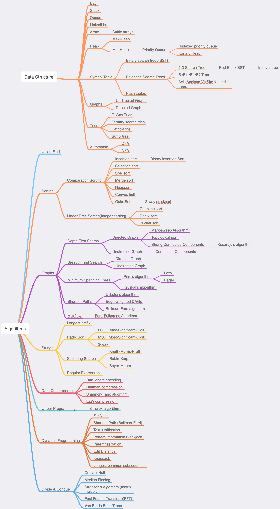

# My Leetcode Solutions

If you have a better soluton or find an error, please feel free to open a PR. Thanks.

| # | Title | Solution | Difficulty |
|---| ----- | -------- | ---------- |
|1|[Two Sum](https://leetcode.com/problems/two-sum/) | [Swift](./algorithms/swift/2Sum/2Sum.swift)|Easy|
|2|[Add Two Numbers](https://leetcode.com/problems/add-two-numbers/) | [Swift](./algorithms/swift/addTwoNumbers/addTwoNumbers.swift)|Medium|
|3|[Longest Substring Without Repeating Characters](https://leetcode.com/problems/longest-substring-without-repeating-characters/) | [Swift](./algorithms/swift/longestSubstringWithoutRepeatingCharacters/longestSubstringWithoutRepeatingCharacters.swift)|Medium|
|5|[Longest Palindromic Substring](https://leetcode.com/problems/longest-palindromic-substring/) | [Swift](./algorithms/swift/5-Longest-Palindromic-Substring/5-Longest-Palindromic-Substring.swift)|Medium|
|7|[Reverse Integer](https://leetcode.com/problems/reverse-integer/) | [Swift](./algorithms/swift/7-Reverse-Integer/7-Reverse-Integer.swift)|Easy|
|9|[Palindrome Number](https://leetcode.com/problems/palindrome-number/) | [Swift](./algorithms/swift/9-Palindrome-Number/9-Palindrome-Number.swift)|Easy|
|11|[Container With Most Water](https://leetcode.com/problems/container-with-most-water/) | [Swift](./algorithms/swift/addTwoNumbers/addTwoNumbers.swift)|Medium|
|13|[Roman to Integer](https://leetcode.com/problems/roman-to-integer/) | [Swift](./algorithms/swift/13-Roman-to-Integer/13-Roman-to-Integer.swift)|Easy|
|15|[3Sum](https://leetcode.com/problems/3sum/) | [Swift](./algorithms/swift/15-3Sum/3Sum.swift)|Medium|
|16|[3Sum Closest](https://leetcode.com/problems/3sum-closest/) | [Swift](./algorithms/swift/3sumClosest/3sumClosest.swift)|Medium|
|17|[Letter Combinations of a Phone Number](https://leetcode.com/problems/letter-combinations-of-a-phone-number/) | [Swift](./algorithms/swift/letterCombinationsOfAPhoneNumber/letterCombinationsOfAPhoneNumber.swift)|Medium|
|18|[4Sum](https://leetcode.com/problems/4sum/) | [Swift](./algorithms/swift/4sum/4sum.swift)|Medium|
|19|[Remove Nth Node From End of List](https://leetcode.com/problems/remove-nth-node-from-end-of-list/) |[Swift](./algorithms/swift/removeNthNodeFromEndOfList/removeNthNodeFromEndOfList.swift)|Medium|
|20|[Valid Parentheses](https://leetcode.com/problems/valid-parentheses) | [Swift](./algorithms/swift/validParentheses/validParentheses.swift)|Easy|
|21|[Merge Two Sorted Lists](https://leetcode.com/problems/merge-two-sorted-lists/) |[Swift](./algorithms/swfit/mergeTwoSortedList/mergeTwoSortedList.swift)|Easy|
|22|[Generate Parentheses](https://leetcode.com/problems/generate-parentheses/) | [Swift](./algorithms/swift/generateParentheses/generateParentheses.swift)|Medium|
|23|[Merge k Sorted Lists](https://leetcode.com/problems/merge-k-sorted-lists/) | [Swift](./algorithms/swift/mergeKSortedLists/mergeKSortedLists.swift)|Hard|
|24|[Swap Nodes in Pairs](https://leetcode.com/problems/swap-nodes-in-pairs/) | [Swift](./algorithms/swift/swapNodesInPairs/swapNodesInPairs.swift)|Medium|
|25|[Reverse Nodes in k-Group](https://leetcode.com/problems/reverse-nodes-in-k-group/) | [Swift](./algorithms/swift/reverseNodesInKGroup/reverseNodesInKGroup.swift)|Hard|
|26|[Remove Duplicates from Sorted Array](https://leetcode.com/problems/remove-duplicates-from-sorted-array/) | [Swift](./algorithms/swift/removeDuplicatesFromSortedArray/removeDuplicatesFromSortedArray.swift)|Easy|
|27|[Remove Element](https://leetcode.com/problems/remove-element/) | [Swift](./algorithms/swift/removeElement/removeElement.swift)|Easy|
|28|[Implement strStr()](https://leetcode.com/problems/implement-strstr/) | [Swift](./algorithms/swift/implementStrStr/implementStrStr().swift)|Easy|
|29|[Divide Two Integers](https://leetcode.com/problems/divide-two-integers/) | [Swift](./algorithms/swift/divideTwoIntegers/divideTwoIntegers.swift)| Medium |
|31|[Next Permutation](https://leetcode.com/problems/next-permutation/) | [Swift](./algorithms/swift/nextPermutation/nextPermutation.swift)| Medium |
|32|[Longest Valid Parentheses](https://leetcode.com/problems/longest-valid-parentheses/) | [Swift](./algorithms/swift/longestValidParentheses/longestValidParentheses.swift)|Hard|
|33|[Search in Rotated Sorted Array](https://leetcode.com/problems/search-in-rotated-sorted-array/) | [Swift](./algorithms/swift/searchInRotatedSortedArray/searchInRotatedSortedArray.swift)|Medium|
|34|[Find First and Last Position of Element in Sorted Array](https://leetcode.com/problems/find-first-and-last-position-of-element-in-sorted-array/) | [Swift](./algorithms/swift/findFirstAndLastPositionOfElementInSortedArray/findFirstAndLastPositionOfElementInSortedArray.swift)|Medium|
|35|[Search Insert Position](https://leetcode.com/problems/search-insert-position/) | [Swift](./algorithms/swift/35-Search-Insert-Position/35-Search-Insert-Position.swift)|Easy|
|36|[Valid Sudoku](https://leetcode.com/problems/valid-sudoku/) | [Swift](./algorithms/swift/validSudoku/validSudoku.swift)|Medium|
|37|[Sudoku Solver](https://leetcode.com/problems/sudoku-solver/) | [Swift](./algorithms/swift/sudokuSolver/sudokuSolver.swift)|Hard|
|38|[Count and Say](https://leetcode.com/problems/count-and-say/) | [Swift](./algorithms/swift/38-Count-and-Say/38-Count-and-Say.swift)|Easy|
|39|[Combination Sum](https://leetcode.com/problems/combination-sum/) | [Swift](./algorithms/swift/combinationSum/combinationSum.swift)| Medium |
|40|[Combination Sum II](https://leetcode.com/problems/combination-sum-ii/) | [Swift](./algorithms/swift/40-Combination-Sum-II/40-Combination-Sum-II.swift)| Medium |
|41|[First Missing Positive](https://leetcode.com/problems/first-missing-positive/) | [Swift](./algorithms/swift/firstMissingPositive/firstMissingPositive.swift)|Hard|
|42|[Trapping Rain Water](https://leetcode.com/problems/trapping-rain-water/) | [Swift](./algorithms/swift/trappingRainWater/trappingRainWater.swift)|Hard|
|43|[Multiply Strings](https://leetcode.com/problems/multiply-strings/) | [Swift](./algorithms/swift/multiplyStrings/multiplyStrings.swift)|Medium|
|46|[Permutations](https://leetcode.com/problems/permutations/) | [Swift](./algorithms/swift/permutations/permutations.swift)|Medium|
|48|[Rotate Image](https://leetcode.com/problems/rotate-image/) | [Swift](./algorithms/swift/rotateImage/rotateImage.swift)|Medium|
|49|[Group Anagrams](https://leetcode.com/problems/group-anagrams/) | [Swift](./algorithms/swift/49-Group-Anagrams/49-Group-Anagrams.swift)|Medium|
|50|[Pow(x,n)](https://leetcode.com/problems/powx-n/) | [Swift](./algorithms/swift/pow/pow.swift)|Medium|
|51|[N-Queens](https://leetcode.com/problems/n-queens/) | [Swift](./algorithms/swift/nQueens/nQueens.swift), [Swift](./algorithms/swift/nQueens/nQueensII.swift), |Hard|
|52|[N-Queens II](https://leetcode.com/problems/n-queens/) | [Swift](./algorithms/swift/nQueensII/nQueensII.swift)|Hard|
|53|[Maximum SubArray](https://leetcode.com/problems/maximum-subarray/) | [Swift](./algorithms/swift/maximumSubarray/maximumSubarray.swift)|Easy|
|54|[Spiral Matrix](https://leetcode.com/problems/spiral-matrix/) | [Swift](./algorithms/swift/spiralMatrix/spiralMatrix.swift)|Medium|
|55|[Jump Game](https://leetcode.com/problems/jump-game/) | [Swift](./algorithms/swift/55-Jump-Game/55-Jump-Game.swift)|Medium|
|56|[Merge Intervals](https://leetcode.com/problems/merge-intervals/) | [Swift](./algorithms/swift/mergeIntervals/mergeIntervals.swift)|Medium|
|57|[Insert Interval](https://leetcode.com/problems/insert-interval/) | [Swift](./algorithms/swift/insertInterval/insertInterval.swift)|Hard|
|59|[Spiral Matrix II](https://leetcode.com/problems/spiral-matrix-ii/) | [Swift](./algorithms/swift/spiralMatrixII/spiralMatrixII.swift)|Medium|
|60|[Permutation Sequence](https://leetcode.com/problems/permutation-sequence/) | [Swift](./algorithms/swift/60-Permutation-Sequence/60-Permutation-Sequence.swift)|Medium|
|62|[Unique Paths](https://leetcode.com/problems/unique-paths/) | [Swift](./algorithms/swift/62-Unique-Paths/62-Unique-Paths.swift)|Medium|
|63|[Unique Paths II](https://leetcode.com/problems/unique-paths-ii/) | [Swift](./algorithms/swift/uniquePaths-II/uniquePaths-II.swift)|Medium|
|64|[Minimum Path Sum](https://leetcode.com/problems/minimum-path-sum/) | [Swift](./algorithms/swift/minimumPathSum/minimumPathSum.swift)|Medium|
|66|[Plus One](https://leetcode.com/problems/plus-one) | [Swift](./algorithms/swift/66-Plus-One/66-Plus-One.swift)|Easy|
|67|[Add Binary](https://leetcode.com/problems/add-binary/) | [Swift](./algorithms/swift/addBinary/addBinary.swift)|Easy|
|69|[Sqrt(x)](https://leetcode.com/problems/sqrtx/) | [Swift](./algorithms/swift/sqrtx/sqrtx.swift), [Swift](./algorithms/swift/sqrtx/sqrtxII.swift)|Easy|
|70|[Climbing Stairs](https://leetcode.com/problems/climbing-stairs/) | [Swift](./algorithms/swift/70-Climbing-Stairs/70-Climbing-Stairs.swift), [Swift](./algorithms/swift/70-Climbing-Stairs/70-Climbing-Stairs-II.swift)|Easy|
|71|[Simplify Path](https://https://leetcode.com/problems/simplify-path/) | [Swift](./algorithms/swift/simplifyPath/simplifyPath.swift)|Medium|
|72|[Edit Distance](https://leetcode.com/problems/edit-distance/) | [Swift](./algorithms/swift/editDistance/editDistance.swift)|Hard|
|73|[Set Matrix Zeroes](https://leetcode.com/problems/set-matrix-zeroes/) | [Swift](./algorithms/swift/setMatrixZeroes/setMatrixZeroes.swift)|Medium|
|74|[Search a 2D Matrix](https://leetcode.com/problems/search-a-2d-matrix/) | [Swift](./algorithms/swift/searchA2DMatrix/searchA2DMatrix.swift)|Medium|
|75|[Sort Colors](https://leetcode.com/problems/sort-colors/) | [Swift](./algorithms/swift/75-Sort-Colors/75-Sort-Colors.swift)|Medium|
|76|[Minimum Window Substring](https://leetcode.com/problems/minimum-window-substring/) | [Swift](./algorithms/swift/minimumWindowSubString/minimumWindowSubString.swift)|Hard|
|78|[Subsets](https://leetcode.com/problems/subsets/) | [Swift](./algorithms/swift/subsets/subsets.swift)|Medium|
|79|[Word Search](https://leetcode.com/problems/word-search/) | [Swift](./algorithms/swift/wordSearch/wordSearch.swift)|Medium|
|80|[Remove Duplicates from Sorted Array II](https://leetcode.com/problems/remove-duplicates-from-sorted-array-ii/) | [Swift](./algorithms/swift/removeDuplicatesFromSortedArray-II/removeDuplicatesFromSortedArray-II.swift)|Medium|
|81|[Search in Rotated Sorted Array II](https://leetcode.com/problems/search-in-rotated-sorted-array-ii/) | [Swift](./algorithms/swift/searchInRotatedSortedArrayII/searchInRotatedSortedArrayII.swift)|Medium|
|82|[Remove Duplicates from Sorted List II](https://leetcode.com/problems/remove-duplicates-from-sorted-list-ii/) | [Swift](./algorithms/swift/removeDuplicatesFromSortedListII/removeDuplicatesFromSortedListII/removeDuplicatesFromSortedListII/removeDuplicatesFromSortedListII.swift)|Medium|
|83|[Remove Duplicates from Sorted List](https://leetcode.com/problems/remove-duplicates-from-sorted-list/) | [Swift](./algorithms/swift/removeDuplicatesFromSortedList/removeDuplicatesFromSortedList.swift)| Easy |
|86|[Partition List](https://leetcode.com/problems/partition-list/) | [Swift](./algorithms/swift/partitionList/partitionList.swift)|Medium|
|88|[Merge Sorted Array](https://leetcode.com/problems/merge-sorted-array/) | [Swift](./algorithms/swift/mergeSortedArray/mergeSortedArray.swift)| Easy |
|90|[Subsets II](https://leetcode.com/problems/subsets-ii/) | [Swift](./algorithms/swift/subsets-II/subsets-II.swift)| Medium |
|92|[Reverse Linked List II](https://leetcode.com/problems/reverse-linked-list-ii/) | [Swift](./algorithms/swift/reverseLinkedList-II/reverseLinkedList-II.swift)| Medium |
|93|[Restore IP Addresses](https://leetcode.com/problems/restore-ip-addresses/) | [Swift](./algorithms/swift/restoreIPAddress/restoreIPAddress.swift)| Medium |
|94|[Binary Tree Inorder Traversal](https://leetcode.com/problems/binary-tree-inorder-traversal/) | [Swift](./algorithms/swift/binaryTreeInorderTraversal/binaryTreeInorderTraversal.swift)| Medium |
|95|[Unique Binary Search Trees II](https://leetcode.com/problems/unique-binary-search-trees-ii/) | [Swift](./algorithms/swift/uniqueBinarySearchTrees-II/uniqueBinarySearchTrees-II.swift)| Medium |
|96|[Unique Binary Search Trees](https://leetcode.com/problems/unique-binary-search-trees/) | [Swift](./algorithms/swift/96-Unique-Binary-Search-Trees/96-Unique-Binary-Search-Trees.swift)| Medium |
|98|[Validate Binary Search Tree](https://leetcode.com/problems/validate-binary-search-tree/) | [Swift](./algorithms/swift/98-Validate-Binary-Serch-Tree/98-Validate-Binary-Serch-Tree.swift) |Medium|
|100|[Same Tree](https://leetcode.com/problems/same-tree/) | [Swift](./algorithms/swift/sameTree/sameTree.swift) |Easy|
|101|[Symmetric Tree](https://leetcode.com/problems/symmetric-tree/) | [Swift](./algorithms/swift/symmetricTree/symmetricTree.swift) |Easy|
|102|[Binary Tree Level Order Traversal](https://leetcode.com/problems/binary-tree-level-order-traversal/) | [Swift](./algorithms/swift/binaryTreeLevelOrderTraversal/binaryTreeLevelOrderTraversal.swift)|Medium|
|103|[Binary Tree Zigzag Level Order Traversal](https://leetcode.com/problems/binary-tree-zigzag-level-order-traversal/) | [Swift](./algorithms/swift/binaryTreeZigZagLevelOrderTraversal/binaryTreeZigZagLevelOrderTraversal.swift)| Medium |
|104|[Maximum Depth of Binary Tree](https://leetcode.com/problems/maximum-depth-of-binary-tree/) | [Swift](./algorithms/swift/maximumDepthOfBinaryTree/maximumDepthOfBinaryTree.swift)|Easy|
|105|[Construct Binary Tree from Preorder and Inorder Traversal](https://leetcode.com/problems/construct-binary-tree-from-preorder-and-inorder-traversal/) | [Swift](./algorithms/swift/constructBinaryTreeFromPreorderAndInorderTraversal/constructBinaryTreeFromPreorderAndInorderTraversal.swift)|Medium|
|106|[Construct Binary Tree from Inorder and Postorder Traversal](https://leetcode.com/problems/construct-binary-tree-from-preorder-and-inorder-traversal/) | [Swift](./algorithms/swift/constructBinaryTreeFromInorderAndPostorderTraversal/constructBinaryTreeFromInorderAndPostorderTraversal.swift)|Medium|
|107|[Binary Tree Level Order Traversal II](https://leetcode.com/problems/binary-tree-level-order-traversal-ii/) | [Swift](./algorithms/swift/107-Binary-Tree-Level-Order-Traversal-II/107-Binary-Tree-Level-Order-Traversal-II.swift)|Easy|
|108|[Convert Sorted Array to Binary Search Tree](https://leetcode.com/problems/convert-sorted-array-to-binary-search-tree/) | [Swift](./algorithms/swift/convertSortedArrayToBinarySearchTree/convertSortedArrayToBinarySearchTree.swift)|Easy|
|109|[Convert Sorted List to Binary Search Tree](https://leetcode.com/problems/convert-sorted-list-to-binary-search-tree/) | [Swift](./algorithms/swift/convertSortedListToBinarySearchTree/convertSortedListToBinarySearchTree.swift)|Medium|
|110|[Balanced Binary Tree](https://leetcode.com/problems/balanced-binary-tree/) | [Swift](./algorithms/swift/balancedBinaryTree/balancedBinaryTree.swift)|Easy|
|111|[Minimum Depth of Binary Tree](https://leetcode.com/problems/minimum-depth-of-binary-tree/) | [Swift](./algorithms/swift/minimumDepthOfBinaryTree/minimumDepthOfBinaryTree.swift)|Easy|
|112|[Path Sum](https://leetcode.com/problems/path-sum/) | [Swift](./algorithms/swift/pathSum/pathSum.swift)|Easy|
|113|[Path Sum II](https://leetcode.com/problems/path-sum-ii/) | [Swift](./algorithms/swift/pathSum-II/pathSum-II.swift)|Medium|
|116|[Populating Next Right Pointers in Each Node](https://leetcode.com/problems/populating-next-right-pointers-in-each-node/) | [Swift](./algorithms/swift/pathSum-II/pathSum-II.swift)|Medium|
|117|[Populating Next Right Pointers in Each Node II](https://leetcode.com/problems/populating-next-right-pointers-in-each-node-ii/) | [Swift](./algorithms/swift/117-Populating-Next-Right-Pointers-in-Each-Node-II/117-Populating-Next-Right-Pointers-in-Each-Node-II.swift)|Medium|
|118|[Pascal's Triangle](https://leetcode.com/problems/pascals-triangle/) | [Swift](./algorithms/swift/pascalsTriangle/pascalsTriangle.swift)|Easy|
|119|[Pascal's Triangle II](https://leetcode.com/problems/pascals-triangle-ii/) | [Swift](./algorithms/swift/pascalsTriangleII/pascalsTriangleII.swift)|Easy|
|120|[Triangle](https://leetcode.com/problems/triangle/) | [Swift](./algorithms/swift/triangle/triangle.swift)|Medium|
|121|[Best Time to Buy and Sell Stock](https://leetcode.com/problems/best-time-to-buy-and-sell-stock/) | [Swift](./algorithms/swift/121-Best-Time-to-Buy-and-Sell-Stock/121-Best-Time-to-Buy-and-Sell-Stock.swift)|Easy|
|122|[Best Time to Buy and Sell Stock II](https://leetcode.com/problems/best-time-to-buy-and-sell-stock-ii/) | [Swift](./algorithms/swift/bestTimeToBuyAndSellStockII/bestTimeToBuyAndSellStockII.swift), [Swift](./algorithms/swift/bestTimeToBuyAndSellStockII/bestTimeToBuyAndSellStockII-II.swift)|Easy|
|123|[Best Time to Buy and Sell Stock III](https://leetcode.com/problems/best-time-to-buy-and-sell-stock-iii/) | [Swift](./algorithms/swift/bestTimeToBuyAndSellStockIII/bestTimeToBuyAndSellStockIII.swift), [Swift](./algorithms/swift/bestTimeToBuyAndSellStockIII/bestTimeToBuyAndSellStockIII-DP.swift)|Hard|
|124|[Binary Tree Maximum Path Sum](https://leetcode.com/problems/binary-tree-maximum-path-sum/) | [Swift](./algorithms/swift/124-Binary-Tree-Maximum-Path-Sum/124-Binary-Tree-Maximum-Path-Sum.swift)|Hard|
|125|[Valid Palindrome](https://leetcode.com/problems/valid-palindrome/) | [Swift](./algorithms/swift/validPalindrome/validPalindrome.swift)|Easy|
|129|[Sum Root to Leaf Numbers](https://leetcode.com/problems/sum-root-to-leaf-numbers/) | [Swift](./algorithms/swift/129-Sum-Root-to-Leaf-Numbers/129-Sum-Root-to-Leaf-Numbers.swift)|Medium|
|130|[Surrounded Regions](https://leetcode.com/problems/surrounded-regions/) | [Swift](./algorithms/swift/130-Surrounded-Regions/130-Surrounded-Regions.swift)|Medium|
|136|[Single Number](https://leetcode.com/problems/single-number/) | [Swift](./algorithms/swift/singleNumber/singleNumber.swift)|Easy|
|137|[Single Number II](https://leetcode.com/problems/single-number-ii/) | [Swift](./algorithms/swift/137-Single-Number-II/137-Single-Number-II.swift)| Medium |
|139|[Word Break](https://leetcode.com/problems/word-break/) | [Swift](./algorithms/swift/wordBreak/wordBreak.swift)|Medium|
|141|[Linked List Cycle](https://leetcode.com/problems/linked-list-cycle/) |[Swift](./algorithms/swift/linkedListCycle/linkedListCycle.swift)|Easy|
|142|[Linked List Cycle II](https://leetcode.com/problems/linked-list-cycle-ii/) | [Swift](./algorithms/swift/linkedListCycleII/linkedListCycleII.swift)|Medium|
|143|[Reorder List](https://leetcode.com/problems/reorder-list/) | [Swift](./algorithms/swift/reorderList/reorderList.swift) | Medium |
|144|[Binary Tree Preorder Traversal](https://leetcode.com/problems/binary-tree-preorder-traversal/) | [Swift](./algorithms/swift/binaryTreePreorderTraversal/binaryTreePreorderTraversal.swift) | Medium |
|145|[Binary Tree Postorder Traversal](https://leetcode.com/problems/binary-tree-postorder-traversal/) | [Swift](./algorithms/swift/binaryTreePostorderTraversal/binaryTreePostorderTraversal.swift) | Hard |
|146|[LRU Cache](https://leetcode.com/problems/lru-cache/) | [Swift](./algorithms/swift/146-LRU-Cache/146-LRU-Cache.swift) | Medium |
|147|[Insertion Sort List](https://leetcode.com/problems/insertion-sort-list/) | [Swift](./algorithms/swift/insertionSortList/insertionSortList.swift) | Medium |
|148|[Sort List](https://leetcode.com/problems/sort-list/) | [Swift](./algorithms/swift/sortList/sortList.swift) | Medium |
|150|[Evaluate Reverse Polish Notation](https://leetcode.com/problems/evaluate-reverse-polish-notation/) | [Swift](./algorithms/swift/evaluateReversePolishNotation/evaluateReversePolishNotation.swift) | Medium |
|152|[Maximum Product Subarray](https://leetcode.com/problems/maximum-product-subarray/) | [Swift](./algorithms/swift/maximumProductSubArray/maximumProductSubArray.swift), [Swift](./algorithms/swift/maximumProductSubArray/maximumProductSubArray-II.swift)|Medium|
|153|[Find Minimum in Rotated Sorted Array](https://leetcode.com/problems/find-minimum-in-rotated-sorted-array/) | [Swift](./algorithms/swift/findMinimumInRotatedSortedArray/findMinimumInRotatedSortedArray.swift)|Medium|
|155|[Min Stack](https://leetcode.com/problems/min-stack/) | [Swift](./algorithms/swift/minStack/minStack.swift)| Easy |
|156|[Binary Tree Upside Down](https://leetcode.com/problems/binary-tree-upside-down/) | [Swift](./algorithms/swift/156-Binary-Tree-Upside-Down/156-Binary-Tree-Upside-Down.swift)| Medium |
|159|[Longest Substring with At Most Two Distinct Characters](https://leetcode.com/problems/longest-substring-with-at-most-two-distinct-characters/) | [Swift](./algorithms/swift/159-Longest-Substring-with-At-Most-Two-Distinct-Characters/159-Longest-Substring-with-At-Most-Two-Distinct-Characters.swift)| Medium |
|162|[Find Peak Element](https://leetcode.com/problems/find-peak-element/) | [Swift](./algorithms/swift/findPeakElement/findPeakElement.swift)| Medium |
|163|[Missing Ranges](https://leetcode.com/problems/missing-ranges/) | [Swift](./algorithms/swift/missingRanges/missingRanges.swift)| Medium |
|167|[Two Sum II - input array is sorted](https://leetcode.com/problems/two-sum-ii-input-array-is-sorted/) | [Swift](./algorithms/swift/2SumII/2SumII.swift)|Easy|
|169|[Majority Element](https://leetcode.com/problems/majority-element/) | [Swift](./algorithms/swift/169-Majority-Element/169-Majority-Element.swift)|Easy|
|171|[Excel Sheet Column Number](https://leetcode.com/problems/excel-sheet-column-number/) | [Swift](./algorithms/swift/171-Excel-Sheet-Column-Number/171-Excel-Sheet-Column-Number.swift)|Easy|
|173|[Binary Search Tree Iterator](https://leetcode.com/problems/binary-search-tree-iterator/) | [Swift](./algorithms/swift/binarySearchTreeIterator/binarySearchTreeIterator.swift)| Medium |
|174|[Dungeon Gamer](https://leetcode.com/problems/dungeon-game/) | [Swift](./algorithms/swift/174-Dungeon-Game/174-Dungeon-Game.swift)| Hard |
|189|[Rotate Array](https://leetcode.com/problems/rotate-array/) | [Swift](./algorithms/swift/rotateArray/rotateArray.swift)|Easy|
|191|[Number of 1 Bits](https://leetcode.com/problems/number-of-1-bits/) |[Swift](./algorithms/swift/numberOf1Bits/numberOf1Bits.swift)|Easy|
|199|[Binary Tree Right Side View](https://leetcode.com/problems/binary-tree-right-side-view/) | [Swift](./algorithms/swift/binaryTreeRightSideView/binaryTreeRightSideView.swift)| Medium |
|200|[Number of Islands](https://leetcode.com/problems/number-of-islands/) | [Swift](./algorithms/swift/200-Number-of-Islands/200-Number-of-Islands.swift)| Medium |
|201|[Bitwise AND of Numbers Range](https://leetcode.com/problems/bitwise-and-of-numbers-range/) | [Swift](./algorithms/swift/201-Bitwise-AND-of-Numbers-Range/201-Bitwise-AND-of-Numbers-Range.swift)| Medium |
|202|[Happy Number](https://leetcode.com/problems/happy-number/) | [Swift](./algorithms/swift/happyNumber/happyNumber.swift)|Easy|
|203|[Remove Linked List Element](https://leetcode.com/problems/remove-linked-list-elements/) |[Swift](./algorithms/swift/removeLinkedListElements/removeLinkedListElements.swift)|Easy|
|206|[Reverse Linked List](https://leetcode.com/problems/reverse-linked-list/) |[Swift](./algorithms/swift/reverseLinkedList/reverseLinkedList0.swift), [Swift](./algorithms/swift/reverseLinkedList/reverseLinkedList1.swift), [Swift](./algorithms/swift/reverseLinkedList/reverseLinkedList2.swift), [Swift](./algorithms/swift/reverseLinkedList/reverseLinkedList3.swift) |Easy|
|207|[Course Schedule](https://leetcode.com/problems/course-schedule/) | [Swift](./algorithms/swift/207-Course-Schedule/207-Course-Schedule.swift)|Medium|
|208|[Implement Trie (Prefix Tree)](https://leetcode.com/problems/implement-trie-prefix-tree/) | [Swift](./algorithms/swift/208-Implement-Tire/208-Implement-Tire.swift)|Medium|
|209|[Minimum Size Subarray Sum](https://leetcode.com/problems/minimum-size-subarray-sum/) | [Swift](./algorithms/swift/minimumSizeSubarraySum/minimumSizeSubarraySum.swift)|Medium|
|210|[Course Schedule II](https://leetcode.com/problems/course-schedule-ii/) | [Swift](./algorithms/swift/courseScheduleII/courseScheduleII.swift)|Medium|
|211|[Add and Search Word - Data structure design](https://leetcode.com/problems/add-and-search-word-data-structure-design/) | [Swift](./algorithms/swift/addAndSearchWord-DataStructureDesign/addAndSearchWord-DataStructureDesign.swift)|Medium|
|212|[Word Search II](https://leetcode.com/problems/word-search-ii/) | [Swift](./algorithms/swift/212-Word-Search-II/212-Word-Search-II.swift)|Hard|
|215|[Kth Largest Element in an Array](https://leetcode.com/problems/kth-largest-element-in-an-array/) | [Swift](./algorithms/swift/kthLargestElementInAnArray/kthLargestElementInAnArray.swift)|Medium|
|216|[Combination Sum III](https://leetcode.com/problems/combination-sum-iii/) | [Swift](./algorithms/swift/combinationSum-III/combinationSum-III.swift)|Medium|
|217|[Contains Duplicate](https://leetcode.com/problems/contains-duplicate/) | [Swift](./algorithms/swift/containsDuplicate/containsDuplicate.swift)|Easy|
|219|[Contains Duplicate II](https://leetcode.com/problems/contains-duplicate-ii/) | [Swift](./algorithms/swift/containsDuplicateII/containsDuplicateII.swift)|Easy|
|221|[Maximal Square](https://leetcode.com/problems/maximal-square/) | [Swift](./algorithms/swift/221-Maximal-Square/221-Maximal-Square.swift)|Medium|
|222|[Count Complete Tree Nodes](https://leetcode.com/problems/count-complete-tree-nodes/) | [Swift](./algorithms/swift/222-Count-Complete-Tree-Nodes/222-Count-Complete-Tree-Nodes.swift)|Medium|
|223|[Rectangle Area](https://leetcode.com/problems/rectangle-area/) | [Swift](./algorithms/swift/223-Rectangle-Area/223-Rectangle-Area.swift)|Medium|
|224|[Basic Calculator](https://leetcode.com/problems/basic-calculator/) | [Swift](./algorithms/swift/basicCalculator/basicCalculator.swift) |Hard|
|225|[Implement Stack using Queue](https://leetcode.com/problems/implement-stack-using-queues/) | [Swift](./algorithms/swift/implementStackUsingQueue/implementStackUsingQueue.swift)|Easy|
|226|[Invert Binary Tree](https://leetcode.com/problems/invert-binary-tree/) | [Swift](./algorithms/swift/226-Invert-Binary-Tree/226-Invert-Binary-Tree.swift)|Easy|
|227|[Basic Calculator II](https://leetcode.com/problems/basic-calculator-ii/) | [Swift](./algorithms/swift/basicCalculator-II/basicCalculator-II.swift)|Medium|
|228|[Summary Ranges](https://leetcode.com/problems/summary-ranges/) | [Swift](./algorithms/swift/summaryRanges/summaryRanges.swift)|Medium|
|229|[Majority Element II](https://leetcode.com/problems/majority-element-ii/) | [Swift](./algorithms/swift/majorityElement-II/majorityElement-II.swift)|Medium|
|230|[Kth Smallest Element in a BST](https://leetcode.com/problems/kth-smallest-element-in-a-bst/) | [Swift](./algorithms/swift/230-Kth-Smallest-Element-in-a-BST/230-Kth-Smallest-Element-in-a-BST.swift)|Medium|
|231|[Power of Two](https://leetcode.com/problems/power-of-two/) | [Swift](./algorithms/swift/231-Power-of-Two/231-Power-of-Two.swift)|Easy|
|232|[Implement Queue using Stacks](https://leetcode.com/problems/implement-queue-using-stacks) | [Swift](./algorithms/swift/implementQueueUsingStack/implementQueueUsingStack.swift)|Easy|
|234|[Palindrome Linked List](https://leetcode.com/problems/palindrome-linked-list/) |[Swift](./algorithms/swift/palindromeLinkedList/palindromeLinkedList.swift)|Easy|
|235|[Lowest Common Ancestor of a Binary Search Tree](https://leetcode.com/problems/lowest-common-ancestor-of-a-binary-search-tree/) | [Swift](./algorithms/swift/lowestCommonAncestorOfABinarySearchTree/lowestCommonAncestorOfABinarySearchTree.swift)|Easy|
|236|[Lowest Common Ancestor of a Binary Tree](https://leetcode.com/problems/lowest-common-ancestor-of-a-binary-tree/) | [Swift](./algorithms/swift/lowestCommonAncestorOfABinaryTree/lowestCommonAncestorOfABinaryTree.swift)|Medium|
|237|[Delete Node in a Linked List](https://leetcode.com/problems/delete-node-in-a-linked-list/) | [Swift](./algorithms/swift/237-Delete-Node-in-a-Linked-List/237-Delete-Node-in-a-Linked-List.swift)|Easy|
|238|[Product of Array Except Self](https://leetcode.com/problems/product-of-array-except-self/) | [Swift](./algorithms/swift/238-Product-of-Array-Except-Self/238-Product-of-Array-Except-Self.swift) |Medium|
|239|[Sliding Window Maximum](https://leetcode.com/problems/sliding-window-maximum/) | [Swift](./algorithms/swift/slidingWindowMaximum/slidingWindowMaximum.swift), [Swift](./algorithms/swift/slidingWindowMaximum/slidingWindowMaximumII.swift),[Swift](./algorithms/swift/slidingWindowMaximum/slidingWindowMaximumIII.swift)|Hard|
|240|[Search a 2D Matrix II](https://leetcode.com/problems/search-a-2d-matrix-ii/) | [Swift](./algorithms/swift/240-Search-a-2D-Matrix-II/240-Search-a-2D-Matrix-II.swift) |Medium|
|242|[Valid Anagram](https://leetcode.com/problems/valid-anagram/) | [Swift](./algorithms/swift/validAnagram/validAnagram.swift), [Swift](./algorithms/swift/validAnagram/validAnagramII.swift)|Easy|
|243|[Shortest Word Distance](https://leetcode.com/problems/shortest-word-distance/) | [Swift](./algorithms/swift/shortestWordDistance/shortestWordDistance.swift) |Easy|
|246|[Strobogrammatic Number](https://leetcode.com/problems/strobogrammatic-number/) | [Swift](./algorithms/swift/strobogrammaticNumber/strobogrammaticNumber.swift) |Easy|
|247|[Strobogrammatic Number II](https://leetcode.com/problems/strobogrammatic-number-ii/) | [Swift](./algorithms/swift/strobogrammaticNumber-II/strobogrammaticNumber-II.swift)| Medium |
|249|[Group Shifted Strings](https://leetcode.com/problems/group-shifted-strings/) | [Swift](./algorithms/swift/groupShiftedStrings/groupShiftedStrings.swift)| Medium |
|250|[Count Univalue Subtrees](https://leetcode.com/problems/count-univalue-subtrees/) | [Swift](./algorithms/swift/productOfArrayExceptSelf/productOfArrayExceptSelf.swift) |Medium|
|252|[Meeting Rooms](https://leetcode.com/problems/meeting-rooms/) | [Swift](./algorithms/swift/meetingRooms/meetingRooms.swift) |Easy|
|253|[Meeting Rooms II](https://leetcode.com/problems/meeting-rooms-ii/) | [Swift](./algorithms/swift/meetingRooms-II/meetingRooms-II.swift)| Medium |
|255|[Verify Preorder Sequence in Binary Search Tree](https://leetcode.com/problems/verify-preorder-sequence-in-binary-search-tree/) | [Swift](./algorithms/swift/verifyPreorderSequenceInBinarySearchTree/verifyPreorderSequenceInBinarySearchTree.swift)| Medium |
|257|[Binary Tree Paths](https://leetcode.com/problems/binary-tree-paths/) | [Swift](./algorithms/swift/binaryTreePaths/binaryTreePaths.swift)|Easy|
|259|[3Sum Smaller](https://leetcode.com/problems/3sum-smaller/) | [Swift](./algorithms/swift/259-3Sum-Smaller/259-3Sum-Smaller.swift)| Medium |
|264|[Ugly Number II](https://leetcode.com/problems/ugly-number-ii/) | [Swift](./algorithms/swift/264-Ugly-Number-II/264-Ugly-Number-II.swift)| Medium |
|266|[Palindrome Permutation](https://leetcode.com/problems/palindrome-permutation/) | [Swift](./algorithms/swift/266-Palindrome-Permutation/266-Palindrome-Permutation.swift)|Easy|
|268|[Missing Number](https://leetcode.com/problems/missing-number/) | [Swift](./algorithms/swift/missingNumber/missingNumber.swift)|Easy|
|270|[Closest Binary Search Tree Value](https://leetcode.com/problems/closest-binary-search-tree-value/) | [Swift](./algorithms/swift/closestBinarySearchTreeValue/closestBinarySearchTreeValue.swift)|Easy|
|275|[H-Index II](https://leetcode.com/problems/h-index-ii/) | [Swift](./algorithms/swift/275-H-Index-II/275-H-Index-II.swift)| Medium |
|276|[Paint Fence](https://leetcode.com/problems/paint-fence/) | [Swift](./algorithms/swift/276-Paint-Fence/276-Paint-Fence.swift) |Easy|
|279|[Perfect Squares](https://leetcode.com/https://leetcode.com/problems/perfect-squares/) | [Swift](./algorithms/swift/279-Perfect-Squares/279-Perfect-Squares.swift)| Medium |
|280|[Wiggle Sort](https://leetcode.com/problems/wiggle-sort/) | [Swift](./algorithms/swift/wiggleSort/wiggleSort.swift)| Medium |
|283|[Move Zeroes](https://leetcode.com/problems/move-zeroes/) | [Swift](./algorithms/swift/moveZeroes/moveZeroes.swift)|Easy|
|285|[Inorder Successor in BST](https://leetcode.com/problems/inorder-successor-in-bst/) | [Swift](./algorithms/swift/285-Inorder-Successor-in-BST/285-Inorder-Successor-in-BST.swift)| Medium |
|286|[Walls and Gates](https://leetcode.com/problems/walls-and-gates/) | [Swift](./algorithms/swift/wallsAndGates/wallsAndGates.swift)| Medium |
|287|[Find the Duplicate Number](https://leetcode.com/problems/find-the-duplicate-number/) | [Swift](./algorithms/swift/287-Find-the-Duplicate-Number/287-Find-the-Duplicate-Number.swift), [Swift](./algorithms/swift/287-Find-the-Duplicate-Number/287-Find-the-Duplicate-Number-II.swift)| Medium |
|289|[Game of Life](https://leetcode.com/problems/game-of-life/) | [Swift](./algorithms/swift/gameOfLife/gameOfLife.swift)| Medium |
|295|[Find Median from Data Stream](https://leetcode.com/problems/find-median-from-data-stream/) | [Swift](./algorithms/swift/findMedianFromDataStream/findMedianFromDataStream.swift)|Hard|
|297|[Serialize and Deserialize Binary Tree](https://leetcode.com/problems/serialize-and-deserialize-binary-tree/) | [Swift](./algorithms/swift/297-Serialize-and-Deserialize-Binary-Tree/297-Serialize-and-Deserialize-Binary-Tree.swift)| Medium |
|298|[Binary Tree Longest Consecutive Sequence](https://leetcode.com/problems/binary-tree-longest-consecutive-sequence/) | [Swift](./algorithms/swift/binaryTreeLongestConsecutiveSequence/binaryTreeLongestConsecutiveSequence.swift)| Medium |
|300|[Longest Increasing Subsequence](https://leetcode.com/problems/longest-increasing-subsequence/) | [Swift](./algorithms/swift/longestIncreasingSubsequence/longestIncreasingSubsequence.swift), [Swift](./algorithms/swift/longestIncreasingSubsequence/longestIncreasingSubsequence-II.swift)| Medium |
|303|[Range Sum Query - Immutable](https://leetcode.com/problems/range-sum-query-immutable/) | [Swift](./algorithms/swift/303-Range-Sum-Query-Immutable/303-Range-Sum-Query-Immutable.swift)| Easy |
|304|[Range Sum Query 2D - Immutable](https://leetcode.com/problems/range-sum-query-2d-immutable/) | [Swift](./algorithms/swift/rangeSumQuery2D-Immutable/rangeSumQuery2D-Immutable.swift)| Medium |
|311|[Sparse Matrix Multiplication](https://leetcode.com/problems/sparse-matrix-multiplication/) | [Swift](./algorithms/swift/sparseMatrixMultiplication/sparseMatrixMultiplication.swift)| Medium |
|314|[Binary Tree Vertical Order Traversal](https://leetcode.com/problems/binary-tree-vertical-order-traversal/) | [Swift](./algorithms/swift/binaryTreeVerticalOrderTraversal/binaryTreeVerticalOrderTraversal.swift)|Medium|
|319|[Bulb Switcher](https://leetcode.com/problems/bulb-switcher/) | [Swift](./algorithms/swift/bulbSwitcher/bulbSwitcher.swift)| Medium |
|322|[Coin Change](https://leetcode.com/problems/coin-change/) | [Swift](./algorithms/swift/coinChange/coinChange.swift)|Medium|
|325|[Maximum Size Subarray Sum Equals k](https://leetcode.com/problems/maximum-size-subarray-sum-equals-k/) | [Swift](./algorithms/swift/325-Maximum-Size-Subarray-Sum-Equals-k/325-Maximum-Size-Subarray-Sum-Equals-k.swift)|Medium|
|328|[Odd Even Linked List](https://leetcode.com/problems/odd-even-linked-list/) |[Swift](./algorithms/swift/328-Odd-Even-Linked-List/328-Odd-Even-Linked-List.swift)|Medium|
|329|[Longest Increasing Path in a Matrix](https://leetcode.com/problems/longest-increasing-path-in-a-matrix/) | [Swift](./algorithms/swift/longestIncreasingPathInAMatrix/longestIncreasingPathInAMatrix.swift)|Hard|
|331|[Verify Preorder Serialization of a Binary Tree](https://leetcode.com/problems/verify-preorder-serialization-of-a-binary-tree/) | [Swift](./algorithms/swift/verifyPreorderSerializationOfABinaryTree/verifyPreorderSerializationOfABinaryTree.swift)|Medium|
|332|[Reconstruct Itinerary](https://leetcode.com/problems/reconstruct-itinerary/) | [Swift](./algorithms/swift/332-Reconstruct-Itinerary/332-Reconstruct-Itinerary.swift)|Medium|
|333|[Largest BST Subtree](https://leetcode.com/problems/largest-bst-subtree/) | [Swift](./algorithms/swift/333-Largest-BST-Subtree/333-Largest-BST-Subtree.swift)|Medium|
|334|[Increasing Triplet Subsequence](https://leetcode.com/problems/increasing-triplet-subsequence/) | [Swift](./algorithms/swift/334-Increasing-Triplet-Subsequence/334-Increasing-Triplet-Subsequence.swift)|Medium|
|337|[House Robber III](https://leetcode.com/problems/house-robber-iii/) | [Swift](./algorithms/swift/countingBits/countingBits.swift)|Medium|
|338|[Counting Bits](https://leetcode.com/problems/counting-bits/) | [Swift](./algorithms/swift/338-Counting-Bits/338-Counting-Bits.swift)|Medium|
|339|[Nested List Weight Sum](https://leetcode.com/problems/nested-list-weight-sum/) | [Swift](./algorithms/swift/339-Nested-List-Weight-Sum/339-Nested-List-Weight-Sum.swift)|Easy|
|340|[Longest Substring with At Most K Distinct Characters](https://leetcode.com/problems/longest-substring-with-at-most-k-distinct-characters/) | [Swift](./algorithms/swift/longestSubstringWithAtMostKDistinctCharacters/longestSubstringWithAtMostKDistinctCharacters.swift)|Hard|
|341|[Flatten Nested List Iterator](https://leetcode.com/problems/flatten-nested-list-iterator/) | [Swift](./algorithms/swift/flattenNestedListIterator/flattenNestedListIterator.swift)|Medium|
|344|[Reverse String](https://leetcode.com/problems/reverse-string/) | [Swift](./algorithms/swift/344-Reverse-String/344-Reverse-String.swift)|Easy|
|345|[Reverse Vowels of a String](https://leetcode.com/problems/reverse-vowels-of-a-string/) | [Swift](./algorithms/swift/345-Reverse-Vowels-of-a-String/345-Reverse-Vowels-of-a-String.swift)|Easy|
|346|[Moving Average from Data Stream](https://leetcode.com/problems/moving-average-from-data-stream/) | [Swift](./algorithms/swift/movingAverageFromDataStream/movingAverageFromDataStream.swift)|Easy|
|347|[Top K Frequent Elements](https://leetcode.com/problems/top-k-frequent-elements/) | [Swift](./algorithms/swift/topKFrequentElements/topKFrequentElements.swift)|Medium|
|348|[Design Tic-Tac-Toe](https://leetcode.com/problems/design-tic-tac-toe/) | [Swift](./algorithms/swift/348-Design-Tic-Tac-Toe/348-Design-Tic-Tac-Toe.swift)|Medium|
|349|[Intersection of Two Arrays](https://leetcode.com/problems/intersection-of-two-arrays/) | [Swift](./algorithms/swift/intersectionOfTwoArrays/intersectionOfTwoArrays.swift)|Easy|
|350|[Intersection of Two Arrays II](https://leetcode.com/problems/intersection-of-two-arrays-ii/) | [Swift](./algorithms/swift/intersectionOfTwoArrays-II/intersectionOfTwoArrays-II.swift)|Easy|
|353|[Design Snake Game](https://leetcode.com/problems/design-snake-game/) | [Swift](./algorithms/swift/designSnakeGame/designSnakeGame.swift)|Medium|
|360|[Sort Transformed Array](https://leetcode.com/problems/sort-transformed-array/) | [Swift](./algorithms/swift/360-Sort-Transformed-Array/360-Sort-Transformed-Array.swift)|Medium|
|362|[Design Hit Counter](https://leetcode.com/problems/design-hit-counter/) | [Swift](./algorithms/swift/362-Design-Hit-Counter/362-Design-Hit-Counter.swift)|Medium|
|366|[Find Leaves of Binary Tree](https://leetcode.com/problems/find-leaves-of-binary-tree/) | [Swift](./algorithms/swift/findLeavesOfBinaryTree/findLeavesOfBinaryTree.swift)|Medium|
|367|[Valid Perfect Square](https://leetcode.com/problems/valid-perfect-square/) | [Swift](./algorithms/swift/367-Valid-Perfect-Square/367-Valid-Perfect-Square.swift)|Easy|
|368|[Largest Divisible Subset](https://leetcode.com/problems/largest-divisible-subset/) | [Swift](./algorithms/swift/368-Largest-Divisible-Subset/368-Largest-Divisible-Subset.swift)|Medium|
|369|[Plus One Linked List](https://leetcode.com/problems/plus-one-linked-list/) | [Swift](./algorithms/swift/plusOneLinkedList/plusOneLinkedList.swift)|Medium|
|373|[Find K Pairs with Smallest Sums](https://leetcode.com/problems/find-k-pairs-with-smallest-sums/) | [Swift](./algorithms/swift/findKPairsWithSmallestSums/findKPairsWithSmallestSums.swift)|Medium|
|378|[Kth Smallest Element in a Sorted Matrix](https://leetcode.com/problems/kth-smallest-element-in-a-sorted-matrix/) | [Swift](./algorithms/swift/kthSmallestElementInASortedMatrix/kthSmallestElementInASortedMatrix.swift)|Medium|
|379|[Design Phone Directory](https://leetcode.com/problems/design-phone-directory/) | [Swift](./algorithms/swift/designPhoneDirectory/designPhoneDirectory.swift)|Medium|
|380|[Insert Delete GetRandom O(1)](https://leetcode.com/problems/insert-delete-getrandom-o1/) | [Swift](./algorithms/swift/380-Insert-Delete-GetRandom/380-Insert-Delete-GetRandom.swift)|Medium|
|383|[Ransom Note](https://leetcode.com/problems/ransom-note/) | [Swift](./algorithms/swift/383-Ransom-Note/383-Ransom-Note.swift)|Easy|
|384|[Shuffle an Array](https://leetcode.com/problems/shuffle-an-array/) | [Swift](./algorithms/swift/384-Shuffle-an-Array/384-Shuffle-an-Array.swift)|Medium|
|385|[Mini Parser](https://leetcode.com/problems/mini-parser/) | [Swift](./algorithms/swift/miniParser/miniParser.swift)|Medium|
|387|[First Unique Character in a String](https://leetcode.com/problems/first-unique-character-in-a-string/) | [Swift](./algorithms/swift/387-First-Unique-Character-in-a-String/387-First-Unique-Character-in-a-String.swift)|Easy|
|392|[Is Subsequence](https://leetcode.com/problems/is-subsequence/) | [Swift](./algorithms/swift/392-Is-Subsequence/392-Is-Subsequence.swift)|Easy|
|394|[Decode String](https://leetcode.com/problems/decode-string/) | [Swift](./algorithms/swift/decodeString/decodeString.swift)|Medium|
|398|[Random Pick Index](https://leetcode.com/problems/random-pick-index/) | [Swift](./algorithms/swift/randomPickIndex/randomPickIndex.swift)|Medium|
|402|[Remove K Digits](https://leetcode.com/problems/remove-k-digits/) | [Swift](./algorithms/swift/402-Remove-K-Digits/402-Remove-K-Digits.swift) |Medium|
|404|[Sum of Left Leaves](https://leetcode.com/problems/sum-of-left-leaves/) | [Swift](./algorithms/swift/sumOfLeftLeaves/sumOfLeftLeaves.swift)|Easy|
|406|[Queue Reconstruction by Height](https://leetcode.com/problems/queue-reconstruction-by-height/) | [Swift](./algorithms/swift/406-Queue-Reconstruction-by-Height/406-Queue-Reconstruction-by-Height.swift) |Medium|
|407|[Trapping Rain Water II](https://leetcode.com/problems/trapping-rain-water-ii/) | [Swift](./algorithms/swift/trappingRainWaterII/trappingRainWaterII.swift) |Hard|
|414|[Third Maximum Number](https://leetcode.com/problems/third-maximum-number/)| [Swift](./algorithms/swift/thirdMaximumNumber/theirdMaximumNumber.swift)|Easy|
|415|[Add Strings](https://leetcode.com/problems/add-strings/)| [Swift](./algorithms/swift/addStrings/addStrings.swift)|Easy|
|416|[Partition Equal Subset Sum](https://leetcode.com/problems/partition-equal-subset-sum/) | [Swift](./algorithms/swift/partitionEqualSubsetSum/partitionEqualSubsetSum.swift)| Medium |\
|419|[Battleships in a Board](https://leetcode.com/problems/battleships-in-a-board/) | [Swift](./algorithms/swift/battleshipsInABoard/battleshipsInABoard.swift)| Medium |
|424|[Longest Repeating Character Replacement](https://leetcode.com/problems/longest-repeating-character-replacement/) | [Swift](./algorithms/swift/longestRepeatingCharacterReplacement/longestRepeatingCharacterReplacement.swift)| Medium |
|429|[N-ary Tree Level Order Traversal](https://leetcode.com/problems/n-ary-tree-level-order-traversal/) | [Swift](./algorithms/swift/429-N-ary-Tree-Level-Order-Traversal/429-N-ary-Tree-Level-Order-Traversal.swift)| Medium |
|437|[Path Sum III](https://leetcode.com/problems/path-sum-iii/)| [Swift](./algorithms/swift/pathSum-III/pathSum-III.swift)|Easy|
|438|[Find All Anagrams in a String](https://leetcode.com/problems/find-all-anagrams-in-a-string/) | [Swift](./algorithms/swift/438-Find-All-Anagrams-in-a-String/438-Find-All-Anagrams-in-a-String.swift)| Medium |
|439|[Ternary Expression Parser](https://leetcode.com/problems/ternary-expression-parser/) | [Swift](./algorithms/swift/ternaryExpressionParser/ternaryExpressionParser.swift)| Medium |
|441|[Arranging Coins](https://leetcode.com/problems/arranging-coins/)| [Swift](./algorithms/swift/441-Arranging-Coins/441-Arranging-Coins.swift)|Easy|
|442|[Find All Duplicates in an Array](https://leetcode.com/problems/find-all-duplicates-in-an-array/) | [Swift](./algorithms/swift/findAllDuplicatesInAnArray/findAllDuplicatesInAnArray.swift)| Medium |
|445|[Add Two Numbers II](https://leetcode.com/problems/add-two-numbers-ii/) | [Swift](./algorithms/swift/addTwoNumbers-II/addTwoNumbers-II.swift)| Medium |
|448|[Find All Numbers Disappeared in an Array](https://leetcode.com/problems/find-all-numbers-disappeared-in-an-array/) | [Swift](./algorithms/swift/findAllNumbersDisappearedInAnArray/findAllNumbersDisappearedInAnArray.swift)| Easy |
|449|[Serialize and Deserialize BST](https://leetcode.com/problems/serialize-and-deserialize-bst/) | [Swift](./algorithms/swift/449-Serialize-and-Deserialize-BST/449-Serialize-and-Deserialize-BST.swift)|Medium|
|450|[Delete Node in a BST](https://leetcode.com/problems/delete-node-in-a-bst/) | [Swift](./algorithms/swift/deleteNodeInABST/deleteNodeInABST.swift)|Medium|
|451|[Sort Characters By Frequency](https://leetcode.com/problems/sort-characters-by-frequency/) | [Swift](./algorithms/swift/451-Sort-Characters-By-Frequency/451-Sort-Characters-By-Frequency.swift)|Medium|
|452|[Minimum Number of Arrows to Burst Balloons](https://leetcode.com/problems/minimum-number-of-arrows-to-burst-balloons/) | [Swift](./algorithms/swift/minimumNumberOfArrowsToBurstBalloons/minimumNumberOfArrowsToBurstBalloons.swift)|Medium|
|456|[132 Pattern](https://leetcode.com/problems/132-pattern/) | [Swift](./algorithms/swift/132Pattern/132Pattern.swift)|Medium|
|457|[Circular Array Loop](https://leetcode.com/problems/circular-array-loop/) | [Swift](./algorithms/swift/circularArrayLoop/circularArrayLoop.swift)|Medium|
|461|[Hamming Distance](https://leetcode.com/problems/hamming-distance/)| [Swift](./algorithms/swift/461-Hamming-Distance/461-Hamming-Distance.swift)|Easy|
|463|[Island Perimeter](https://leetcode.com/problems/island-perimeter/)| [Swift](./algorithms/swift/463-Island-Perimeter/463-Island-Perimeter.swift)|Easy|
|468|[Validate IP Address](https://leetcode.com/problems/validate-ip-address/) | [Swift](./algorithms/swift/468-Valid-IP-Address/468-Valid-IP-Address.swift)|Medium|
|476|[Number Complement](https://leetcode.com/problems/number-complement/)| [Swift](./algorithms/swift/476-Number-Complement/476-Number-Complement.swift)|Easy|
|485|[Max Consecutive Ones](https://leetcode.com/problems/max-consecutive-ones/)| [Swift](./algorithms/swift/nextGreaterElement-I/nextGreaterElement-I.swift)|Easy|
|487|[Max Consecutive Ones II](https://leetcode.com/problems/max-consecutive-ones-ii/) | [Swift](./algorithms/swift/487-Max-Consecutive-Ones-II/487-Max-Consecutive-Ones-II.swift)|Medium|
|490|[The Maze](https://leetcode.com/problems/the-maze/) | [Swift](./algorithms/swift/theMaze/theMaze.swift)|Medium|
|494|[Target Sum](https://leetcode.com/problems/target-sum/) | [Swift](./algorithms/swift/targetSum/targetSum.swift)|Medium|
|496|[Next Greater Element I](https://leetcode.com/problems/next-greater-element-i/)| [Swift](./algorithms/swift/maxConsecutiveOnes/maxConsecutiveOnes.swift)|Easy|
|498|[Diagonal Traverse](https://leetcode.com/problems/diagonal-traverse/) | [Swift](./algorithms/swift/diagonalTraverse/diagonalTraverse.swift)|Medium|
|501|[Find Mode in Binary Search Tree](https://leetcode.com/problems/find-mode-in-binary-search-tree/) | [Swift](./algorithms/swift/findModeInBinarySearchTree/findModeInBinarySearchTree.swift)|Easy|
|503|[Next Greater Element II](https://leetcode.com/problems/next-greater-element-ii/) | [Swift](./algorithms/swift/nextGreaterElement-II/nextGreaterElement-II.swift)|Medium|
|508|[Most Frequent Subtree Sum](https://leetcode.com/problems/most-frequent-subtree-sum/) | [Swift](./algorithms/swift/508-Most-Frequent-Subtree-Sum/508-Most-Frequent-Subtree-Sum.swift)|Medium|
|509|[Fibonacci Number](https://leetcode.com/problems/fibonacci-number/) | [Swift](./algorithms/swift/fibonacciNumber/fibonacciNumber.swift)|Easy|
|510|[Inorder Successor in BST II](https://leetcode.com/problems/inorder-successor-in-bst-ii/) | [Swift](./algorithms/swift/510-Inorder-Successor-in-BST-II/510-Inorder-Successor-in-BST-II.swift)| Medium |
|513|[Find Bottom Left Tree Value](https://leetcode.com/problems/find-bottom-left-tree-value/) | [Swift](./algorithms/swift/findBottomLeftTreeValue/findBottomLeftTreeValue.swift)| Medium |
|515|[Find Largest Value in Each Tree Row](https://leetcode.com/problems/find-largest-value-in-each-tree-row/) | [Swift](./algorithms/swift/515-Find-Largest-Value-in-Each-Tree-Row/515-Find-Largest-Value-in-Each-Tree-Row.swift)| Medium |
|518|[Coin Change 2](https://leetcode.com/problems/coin-change-2/) | [Swift](./algorithms/swift/518-Coin-Change-2/518-Coin-Change-2.swift)| Medium |
|523|[Continuous Subarray Sum](https://leetcode.com/problems/continuous-subarray-sum/) | [Swift](./algorithms/swift/continuousSubarraySum/continuousSubarraySum.swift)| Medium |
|524|[Longest Word in Dictionary through Deleting](https://leetcode.com/problems/longest-word-in-dictionary-through-deleting/) | [Swift](./algorithms/swift/524-Longest-Word-in-Dictionary-through-Deleting/524-Longest-Word-in-Dictionary-through-Deleting.swift)| Medium |
|525|[Contiguous Array](https://leetcode.com/problems/contiguous-array/) | [Swift](./algorithms/swift/525-Contiguous-Array/525-Contiguous-Array.swift)| Medium |
|528|[Random Pick with Weight](https://leetcode.com/problems/random-pick-with-weight/) | [Swift](./algorithms/swift/528-Random-Pick-with-Weight/528-Random-Pick-with-Weight.swift)| Medium |
|529|[Minesweeper](https://leetcode.com/problems/minesweeper/) | [Swift](./algorithms/swift/529-Minesweeper/529-Minesweeper.swift)| Medium |
|530|[Minimum Absolute Difference in BST](https://leetcode.com/problems/minimum-absolute-difference-in-bst/) | [Swift](./algorithms/swift/minimumAbsoluteDifferenceInBST/minimumAbsoluteDifferenceInBST.swift)|Easy|
|532|[K-diff Pairs in an Array](https://leetcode.com/problems/k-diff-pairs-in-an-array/) | [Swift](./algorithms/swift/532-K-diff-Pairs-in-an-Array/532-K-diff-Pairs-in-an-Array.swift)|Easy|
|536|[Construct Binary Tree from String](https://leetcode.com/problems/construct-binary-tree-from-string/) | [Swift](./algorithms/swift/536-Construct-Binary-Tree-from-String/536-Construct-Binary-Tree-from-String.swift)| Medium |
|538|[Convert BST to Greater Tree](https://leetcode.com/problems/convert-bst-to-greater-tree/) | [Swift](./algorithms/swift/convertBSTtoGreaterTree/convertBSTtoGreaterTree.swift)|Easy|
|540|[Single Element in a Sorted Array](https://leetcode.com/problems/single-element-in-a-sorted-array/) | [Swift](./algorithms/swift/540-Single-Element-in-a-Sorted-Array/540-Single-Element-in-a-Sorted-Array.swift)| Medium |
|543|[Diameter of Binary Tree](https://leetcode.com/problems/diameter-of-binary-tree/) | [Swift](./algorithms/swift/diameterOfBinaryTree/diameterOfBinaryTree.swift)|Easy|
|545|[Boundary of Binary Tree](https://leetcode.com/problems/boundary-of-binary-tree/) | [Swift](./algorithms/swift/boundaryOfBinaryTree/boundaryOfBinaryTree.swift)| Medium |
|547|[Friend Circles](https://leetcode.com/problems/friend-circles/) | [Swift](./algorithms/swift/friendCircles/friendCircles.swift)| Medium |
|549|[Binary Tree Longest Consecutive Sequence II](https://leetcode.com/problems/binary-tree-longest-consecutive-sequence-ii/) | [Swift](./algorithms/swift/binaryTreeLongestConsecutiveSequence-II/binaryTreeLongestConsecutiveSequence-II.swift)| Medium |
|559|[Maximum Depth of N-ary Tree](https://leetcode.com/problems/maximum-depth-of-n-ary-tree/) | [Swift](./algorithms/swift/559-Maximum-Depth-of-N-ary-Tree/559-Maximum-Depth-of-N-ary-Tree.swift)| Medium |
|560|[Subarray Sum Equals K]( https://leetcode.com/problems/subarray-sum-equals-k/) | [Swift](./algorithms/swift/subarraySumEqualsK/subarraySumEqualsK.swift)| Medium |
|561|[Array Partition I](https://leetcode.com/problems/array-partition-i/) | [Swift](./algorithms/swift/arrayPartitionI/arrayPartitionI.swift)|Easy|
|563|[Binary Tree Tilt](https://leetcode.com/problems/binary-tree-tilt/) | [Swift](./algorithms/swift/binaryTreeTilt/binaryTreeTilt.swift)|Easy|
|565|[Array Nesting](https://leetcode.com/problems/array-nesting/) | [Swift](./algorithms/swift/arrayNesting/arrayNesting.swift)| Medium |
|566|[Reshape the Matrix](https://leetcode.com/problems/reshape-the-matrix/) | [Swift](./algorithms/swift/reshapeTheMatrix/reshapeTheMatrix.swift)|Easy|
|567|[Permutation in String](https://leetcode.com/problems/permutation-in-string/) | [Swift](./algorithms/swift/567-Permutation-in-String/567-Permutation-in-String.swift)| Medium |
|572|[Subtree of Another Tree](https://leetcode.com/problems/subtree-of-another-tree/) | [Swift](./algorithms/swift/subtreeOfAnotherTree/subtreeOfAnotherTree.swift)|Easy|
|581|[Shortest Unsorted Continuous Subarray](https://leetcode.com/problems/shortest-unsorted-continuous-subarray/) | [Swift](./algorithms/swift/shortestUnsortedContinuousSubarray/shortestUnsortedContinuousSubarray.swift), [Swift](./algorithms/swift/shortestUnsortedContinuousSubarray/shortestUnsortedContinuousSubarray-II.swift)|Easy|
|582|[Kill Process](https://leetcode.com/problems/kill-process/) | [Swift](./algorithms/swift/killProcess/killProcess.swift)| Medium |
|589|[N-ary Tree Preorder Traversal](https://leetcode.com/problems/n-ary-tree-preorder-traversal/) | [Swift](./algorithms/swift/589-N-ary-Tree-Preorder-Traversal/589-N-ary-Tree-Preorder-Traversal.swift)|Easy|
|590|[N-ary Tree Postorder Traversal](https://leetcode.com/problems/n-ary-tree-postorder-traversal/) | [Swift](./algorithms/swift/590-N-ary-Tree-Postorder-Traversal/590-N-ary-Tree-Postorder-Traversal-I.swift), [Swift](./algorithms/swift/590-N-ary-Tree-Postorder-Traversal/590-N-ary-Tree-Postorder-Traversal-II.swift)|Easy|
|605|[Can Place Flowers](https://leetcode.com/problems/can-place-flowers/) | [Swift](./algorithms/swift/canPlaceFlowers/canPlaceFlowers.swift)|Easy|
|606|[Construct String from Binary Tree](https://leetcode.com/problems/construct-string-from-binary-tree/) | [Swift](./algorithms/swift/constructStringFromBinaryTree/constructStringFromBinaryTree.swift)|Easy|
|611|[Valid Triangle Number](https://leetcode.com/problems/valid-triangle-number/) | [Swift](./algorithms/swift/validTriangleNumber/validTriangleNumber.swift)| Medium |
|616|[Add Bold Tag in String](https://leetcode.com/problems/add-bold-tag-in-string/) | [Swift](./algorithms/swift/addBoldTagInString/addBoldTagInString.swift)| Medium |
|617|[Merge Two Binary Trees](https://leetcode.com/problems/merge-two-binary-trees/) | [Swift](./algorithms/swift/mergeTwoBinaryTrees/mergeTwoBinaryTrees.swift)|Easy|
|621|[Task Scheduler](https://leetcode.com/problems/task-scheduler/) | [Swift](./algorithms/swift/arrayPartitionI/arrayPartitionI.swift)| Medium |
|622|[Design Circular Queue](https://leetcode.com/problems/design-circular-queue/) | [Swift](./algorithms/swift/designCircularQueue/designCircularQueue.swift)| Medium |
|623|[Add One Row to Tree](https://leetcode.com/problems/add-one-row-to-tree/) | [Swift](./algorithms/swift/623-Add-One-Row-to-Tree/623-Add-One-Row-to-Tree.swift)| Medium |
|628|[Maximum Product of Three Numbers](https://leetcode.com/problems/maximum-product-of-three-numbers/)| [Swift](./algorithms/swift/maximumProductOfThreeNumbers/maximumProductOfThreeNumbers.swift)|Easy|
|630|[Course Schedule III](https://leetcode.com/problems/course-schedule-iii/) | [Swift](./algorithms/swift/courseScheduleIII/courseScheduleIII.swift)| Hard |
|636|[Exclusive Time of Functions](https://leetcode.com/problems/exclusive-time-of-functions/)| [Swift](./algorithms/swift/exclusiveTimeOfFunctions/exclusiveTimeOfFunctions.swift)| Medium |
|637|[Average of Levels in Binary Tree](https://leetcode.com/problems/average-of-levels-in-binary-tree/)| [Swift](./algorithms/swift/averageOfLevelsInBinaryTree/averageOfLevelsInBinaryTree.swift)|Easy|
|641|[Design Circular Deque](https://leetcode.com/problems/design-circular-deque/)| [Swift](./algorithms/swift/designCircularDeque/designCircularDeque.swift)| Medium |
|643|[Maximum Average Subarray I](https://leetcode.com/problems/maximum-average-subarray-i/)| [Swift](./algorithms/swift/maximumAverageSubarray-I/maximumAverageSubarray-I.swift)|Easy|
|647|[Palindromic Substrings](https://leetcode.com/problems/palindromic-substrings/)| [Swift](./algorithms/swift/palindromicSubstrings/palindromicSubstrings.swift)| Medium |
|652|[Find Duplicate Subtrees](https://leetcode.com/problems/find-duplicate-subtrees/)| [Swift](./algorithms/swift/findDuplicateSubtrees/findDuplicateSubtrees.swift)| Medium |
|653|[Two Sum IV - Input is a BST](https://leetcode.com/problems/two-sum-iv-input-is-a-bst/)| [Swift](./algorithms/swift/twoSumIV/twoSumIV.swift)|Easy|
|654|[Maximum Binary Tree](https://leetcode.com/problems/maximum-binary-tree/)| [Swift](./algorithms/swift/maximumBinaryTree/maximumBinaryTree.swift)| Medium |
|655|[Print Binary Tree](https://leetcode.com/problems/print-binary-tree/)| [Swift](./algorithms/swift/655-Print-Binary-Tree/655-Print-Binary-Tree.swift)| Medium |
|658|[Find K Closest Elements](https://leetcode.com/problems/find-k-closest-elements/)| [Swift](./algorithms/swift/findKClosestElements/findKClosestElements.swift)| Medium |
|661|[Image Smoother](https://leetcode.com/problems/image-smoother/)| [Swift](./algorithms/swift/imageSmoother/imageSmoother.swift)|Easy|
|662|[Maximum Width of Binary Tree](https://leetcode.com/problems/maximum-width-of-binary-tree/)| [Swift](./algorithms/swift/662-Maximum-Width-of-Binary-Tree/662-Maximum-Width-of-Binary-Tree.swift)| Medium |
|663|[Equal Tree Partition](https://leetcode.com/problems/equal-tree-partition/)| [Swift](./algorithms/swift/663-Equal-Tree-Partition/663-Equal-Tree-Partition.swift)| Medium |
|665|[Non-decreasing Array](https://leetcode.com/problems/non-decreasing-array/)| [Swift](./algorithms/swift/non-decreasingArray/non-decreasingArray.swift)|Easy|
|666|[Path Sum IV](https://leetcode.com/problems/path-sum-iv/)| [Swift](./algorithms/swift/666-Path-Sum-IV/666-Path-Sum-IV.swift)| Medium |
|667|[Beautiful Arrangement II](https://leetcode.com/problems/beautiful-arrangement-ii/)| [Swift](./algorithms/swift/beautifulArrangement-II/beautifulArrangement-II.swift)| Medium |
|669|[Trim a Binary Search Tree](https://leetcode.com/problems/trim-a-binary-search-tree/)| [Swift](./algorithms/swift/trimABinarySearchTree/trimABinarySearchTree.swift)|Easy|
|670|[Maximum Swap](https://leetcode.com/problems/maximum-swap/)| [Swift](./algorithms/swift/maximumSwap/maximumSwap.swift)| Medium |
|671|[Second Minimum Node In a Binary Tree](https://leetcode.com/problems/second-minimum-node-in-a-binary-tree/)| [Swift](./algorithms/swift/671-Second-Minimum-Node-In-a-Binary-Tree/671-Second-Minimum-Node-In-a-Binary-Tree.swift)|Easy|
|674|[Longest Continuous Increasing Subsequence](https://leetcode.com/problems/longest-continuous-increasing-subsequence/)| [Swift](./algorithms/swift/longestContinuousIncreasingSubsequence/longestContinuousIncreasingSubsequence.swift)|Easy|
|678|[Valid Parenthesis String](https://leetcode.com/problems/valid-parenthesis-string/)| [Swift](./algorithms/swift/678-Valid-Parenthesis-String/678-Valid-Parenthesis-String.swift)| Medium |
|680|[Valid Palindrome II](https://leetcode.com/problems/valid-palindrome-ii/)| [Swift](./algorithms/swift/validPalindrome-II/validPalindrome-II.swift)|Easy|
|682|[Baseball Game](https://leetcode.com/problems/baseball-game/)| [Swift](./algorithms/swift/baseballGame/baseballGame.swift)| Medium |
|684|[Redundant Connection](https://leetcode.com/problems/redundant-connection/)| [Swift](./algorithms/swift/684-Redundant-Connection/684-Redundant-Connection.swift)| Medium |
|687|[Longest Univalue Path](https://leetcode.com/problems/longest-univalue-path/)| [Swift](./algorithms/swift/longestUnivaluePath/longestUnivaluePath.swift)| Easy |
|690|[Employee Importance](https://leetcode.com/problems/employee-importance/)| [Swift](./algorithms/swift/690-Employee-Importance/690-Employee-Importance.swift)| Easy |
|692|[Top K Frequent Words](https://leetcode.com/problems/top-k-frequent-words/)| [Swift](./algorithms/swift/topKFrequentWords/topKFrequentWords.swift)| Medium |
|695|[Max Area of Island](https://leetcode.com/problems/max-area-of-island/)| [Swift](./algorithms/swift/maxAreaOfIsland/maxAreaOfIsland.swift)| Medium |
|697|[Degree of an Array](https://leetcode.com/problems/degree-of-an-array/)| [Swift](./algorithms/swift/degreeOfAnArray/degreeOfAnArray.swift)|Easy|
|700|[Search in a Binary Search Tree](https://leetcode.com/problems/search-in-a-binary-search-tree/) | [Swift](./algorithms/swift/700-Search-in-a-Binary-Search-Tree/700-Search-in-a-Binary-Search-Tree.swift)|Easy|
|701|[Insert into a Binary Search Tree](https://leetcode.com/problems/insert-into-a-binary-search-tree/) | [Swift](./algorithms/swift/insertIntoABinarySearchTree/insertIntoABinarySearchTree.swift)|Medium|
|703|[Kth Largest Element in a Stream](https://leetcode.com/problems/kth-largest-element-in-a-stream/) | [Swift](./algorithms/swift/kthLargestElementInAStream/kthLargestElementInAStream.swift)|Easy|
|704|[Binary Search](https://leetcode.com/problems/binary-search/) | [Swift](./algorithms/swift/binarySearch/binarySearch.swift)|Easy|
|713|[Subarray Product Less Than K](https://leetcode.com/problems/subarray-product-less-than-k/) | [Swift](./algorithms/swift/subarrayProductLessThanK/subarrayProductLessThanK.swift)|Medium|
|714|[Best Time to Buy and Sell Stock with Transaction Fee](https://leetcode.com/problems/best-time-to-buy-and-sell-stock-with-transaction-fee/) | [Swift](./algorithms/swift/bestTimeToBuyAndSellStockWithTransactionFee/bestTimeToBuyAndSellStockWithTransactionFee.swift)| Medium |
|717|[1-bit and 2-bit Characters](https://leetcode.com/problems/1-bit-and-2-bit-characters/) | [Swift](./algorithms/swift/1BitAnd2BitCharacters/1BitAnd2BitCharacters.swift)|Easy|
|718|[Maximum Length of Repeated Subarray](https://leetcode.com/problems/maximum-length-of-repeated-subarray/) | [Swift](./algorithms/swift/maximumLengthOfRepeatedSubarray/maximumLengthOfRepeatedSubarray.swift)|Medium|
|721|[Accounts Merge](https://leetcode.com/problems/accounts-merge/) | [Swift](./algorithms/swift/accountsMerge/accountsMerge.swift)|Medium|
|723|[Candy Crush](https://leetcode.com/problems/candy-crush/) | [Swift](./algorithms/swift/723-Candy-Crush/723-Candy-Crush.swift)|Medium|
|724|[Find Pivot Index](https://leetcode.com/articles/find-pivot-index/) | [Swift](./algorithms/swift/findPivotIndex/findPivotIndex.swift)|Easy|
|725|[Split Linked List in Parts](https://leetcode.com/problems/split-linked-list-in-parts/) | [Swift](./algorithms/swift/splitLinkedListInParts/splitLinkedListInParts.swift)|Medium|
|729|[My Calendar I](https://leetcode.com/problems/my-calendar-i/) | [Swift](./algorithms/swift/729-My-Calendar-I/729-My-Calendar-I.swiftsplitLinkedListInParts.swift)|Medium|
|733|[Flood Fill](https://leetcode.com/problems/flood-fill/) | [Swift](./algorithms/swift/733-Flood-Fill/733-Flood-Fill.swift)|Easy|
|735|[Asteroid Collision](https://leetcode.com/problems/asteroid-collision/) | [Swift](./algorithms/swift/asteroidCollision/asteroidCollision.swift)|Medium|
|739|[Daily Temperatures](https://leetcode.com/problems/daily-temperatures/) | [Swift](./algorithms/swift/dailyTemperatures/dailyTemperatures.swift)|Medium|
|742|[Closest Leaf in a Binary Tree](https://leetcode.com/problems/closest-leaf-in-a-binary-tree/) | [Swift](./algorithms/swift/742-Closest-Leaf-In-A-Binary-Tree/742-Closest-Leaf-In-A-Binary-Tree.swift)|Medium|
|743|[Network Delay Time](https://leetcode.com/problems/network-delay-time/) | [Swift](./algorithms/swift/networkDelayTime/networkDelayTime.swift)|Medium|
|744|[Find Smallest Letter Greater Than Target](https://leetcode.com/problems/find-smallest-letter-greater-than-target/) | [Swift](./algorithms/swift/findSmallestLetterGreaterThanTarget/findSmallestLetterGreaterThanTarget.swift)|Easy|
|746|[Min Cost Climbing Stairs](https://leetcode.com/problems/min-cost-climbing-stairs/) | [Swift](./algorithms/swift/minCostClimbingStairs/minCostClimbingStairs.swift)|Easy|
|747|[Largest Number At Least Twice of Others](https://leetcode.com/problems/largest-number-at-least-twice-of-others/description/) | [Swift](./algorithms/swift/largestNumberAtLeastTwiceOfOthers/largestNumberAtLeastTwiceOfOthers.swift)|Easy|
|750|[Number Of Corner Rectangles](https://leetcode.com/problems/number-of-corner-rectangles/) | [Swift](./algorithms/swift/750-Number-of-Corner-Rectangles/750-Number-of-Corner-Rectangles.swift)|Medium|
|763|[Partition Labels](https://leetcode.com/problems/partition-labels/) | [Swift](./algorithms/swift/763-Partition-Labels/763-Partition-Labels.swift)|Medium|
|766|[Toeplitz Matrix](https://leetcode.com/problems/toeplitz-matrix/) | [Swift](./algorithms/swift/toeplitzMatrix/toeplitzMatrix.swift)|Easy|
|767|[Reorganize String](https://leetcode.com/problems/reorganize-string/) | [Swift](./algorithms/swift/reorganizeString/reorganizeString.swift)| Medium |
|769|[Max Chunks To Make Sorted](https://leetcode.com/problems/max-chunks-to-make-sorted/) | [Swift](./algorithms/swift/maxChunksToMakeSorted/maxChunksToMakeSorted.swift)| Medium |
|771|[Jewels and Stones](https://leetcode.com/problems/jewels-and-stones/) | [Swift](./algorithms/swift/771-Jewels-and-Stones/771-Jewels-and-Stones.swift)|Easy|
|776|[Split BST](https://leetcode.com/problems/split-bst/) | [Swift](./algorithms/swift/776-Split-BST/776-Split-BST.swift)|Medium|
|783|[Minimum Distance Between BST Nodes](https://leetcode.com/problems/minimum-distance-between-bst-nodes/) | [Swift](./algorithms/swift/783-Minimum-Distance-Between-BST-Nodes/783-Minimum-Distance-Between-BST-Node.swift)|Easy|
|784|[Letter Case Permutation](https://leetcode.com/problems/letter-case-permutation/) | [Swift](./algorithms/swift/letterCasePermutation/letterCasePermutation.swift)|Easy|
|785|[Is Graph Bipartite?](https://leetcode.com/problems/is-graph-bipartite/) | [Swift](./algorithms/swift/isGraphBipartite/isGraphBipartite.swift)|Medium|
|787|[Cheapest Flights Within K Stops](https://leetcode.com/problems/cheapest-flights-within-k-stops/) | [Swift](./algorithms/swift/787-Cheapest-Flights-Within-K-Stops/787-Cheapest-Flights-Within-K-Stops.swift)|Medium|
|788|[Rotated Digits](https://leetcode.com/problems/rotated-digits/) | [Swift](./algorithms/swift/788-Rotated-Digits/788-Rotated-Digits.swift)| Medium |
|792|[**Number of Matching Subsequences**](https://leetcode.com/problems/number-of-matching-subsequences/) | [Swift](./algorithms/swift/792-Number-of-Matching-Subsequences/792-Number-of-Matching-Subsequences.swift)| Medium |
|814|[Binary Tree Pruning](https://leetcode.com/problems/binary-tree-pruning/) | [Swift](./algorithms/swift/binaryTreePruning/binaryTreePruning.swift)|Medium|
|817|[Linked List Components](https://leetcode.com/problems/linked-list-components/) | [Swift](./algorithms/swift/linkedListComponents/linkedListComponents.swift)|Medium|
|821|[Shortest Distance to a Character](https://leetcode.com/problems/shortest-distance-to-a-character/) | [Swift](./algorithms/swift/shortestDistanceToACharacter/shortestDistanceToACharacter.swift)|Easy|
|824|[Goat Latin](https://leetcode.com/problems/goat-latin/) | [Swift](./algorithms/swift/goatLatin/goatLatin.swift)|Easy|
|825|[Friends Of Appropriate Ages](https://leetcode.com/problems/friends-of-appropriate-ages/) | [Swift](./algorithms/swift/friendsOfAppropriateAges/friendsOfAppropriateAges.swift)|Medium|
|826|[Most Profit Assigning Work](https://leetcode.com/problems/most-profit-assigning-work/) | [Swift](./algorithms/swift/826-Most-Profit-Assigning-Work/826-Most-Profit-Assigning-Work.swift)|Medium|
|832|[Flipping an Image](https://leetcode.com/problems/flipping-an-image/) | [Swift](./algorithms/swift/flippingAnImage/flippingAnImage.swift)|Easy|
|838|[Push Dominoes](https://leetcode.com/problems/push-dominoes/) | [Swift](./algorithms/swift/pushDominoes/pushDominoes.swift)|Medium|
|844|[Backspace String Compare](https://leetcode.com/problems/backspace-string-compare/) | [Swift](./algorithms/swift/backspaceStringCompare/backspaceStringCompare.swift)|Easy|
|845|[Longest Mountain in Array](https://leetcode.com/problems/longest-mountain-in-array/) | [Swift](./algorithms/swift/845-Longest-Mountain-in-Array/845-Longest-Mountain-in-Array.swift)|Medium|
|849|[Maximize Distance to Closest Person](https://leetcode.com/problems/maximize-distance-to-closest-person/) | [Swift](./algorithms/swift/maximizeDistanceToClosestPerson/maximizeDistanceToClosestPerson.swift)|Easy|
|856|[Score of Parentheses](https://leetcode.com/problems/score-of-parentheses/) | [Swift](./algorithms/swift/scoreOfParentheses/scoreOfParentheses.swift)|Medium|
|865|[Smallest Subtree with all the Deepest Nodes](https://leetcode.com/problems/smallest-subtree-with-all-the-deepest-nodes/) | [Swift](./algorithms/swift/smallestSubtreeWithAllTheDeepestNodes/smallestSubtreeWithAllTheDeepestNodes.swift )|Medium|
|867|[Transpose Matrix](https://leetcode.com/problems/transpose-matrix/) | [Swift](./algorithms/swift/transposeMatrix/transposeMatrix.swift)|Easy|
|871|[Minimum Number of Refueling Stops](https://leetcode.com/problems/minimum-number-of-refueling-stops/) | [Swift](./algorithms/swift/minimumNumberOfRefuelingStops/minimumNumberOfRefuelingStops.swift), [Swift](./algorithms/swift/minimumNumberOfRefuelingStops/minimumNumberOfRefuelingStops-II.swift)|Hard|
|872|[Leaf-Similar Trees](https://leetcode.com/problems/leaf-similar-trees/) | [Swift](./algorithms/swift/leafSimilarTrees/leafSimilarTrees.swift)|Easy|
|876|[Middle of the Linked List](https://leetcode.com/problems/middle-of-the-linked-list/) | [Swift](./algorithms/swift/middleOfTheLinkedList/middleOfTheLinkedList.swift)|Easy|
|877|[Stone Game](https://leetcode.com/problems/stone-game/) | [Swift](./algorithms/swift/877-Stone-Game/877-Stone-Game.swift)| Medium |
|880|[Decoded String at Index](https://leetcode.com/problems/decoded-string-at-index/) | [Swift](./algorithms/swift/decodedStringAtIndex/decodedStringAtIndex.swift)| Medium |
|881|[Boats to Save People](https://leetcode.com/problems/boats-to-save-people/) | [Swift](./algorithms/swift/881-Boats-to-Save-People/881-Boats-to-Save-People.swift)| Medium |
|886|[Possible Bipartition](https://leetcode.com/problems/possible-bipartition/) | [Swift](./algorithms/swift/886-Possible-Bipartition/886-Possible-Bipartition.swift)| Medium |
|888|[Fair Candy Swap](https://leetcode.com/problems/fair-candy-swap/) | [Swift](./algorithms/swift/fairCandySwap/fairCandySwap.swift)|Easy|
|889|[Construct Binary Tree from Preorder and Postorder Traversal](https://leetcode.com/problems/construct-binary-tree-from-preorder-and-postorder-traversal/) | [Swift](./algorithms/swift/constructBinaryTreeFromPreorderAndPostorderTraversal/constructBinaryTreeFromPreorderAndPostorderTraversal.swift)| Medium |
|894|[All Possible Full Binary Trees](https://leetcode.com/problems/all-possible-full-binary-trees/) | [Swift](./algorithms/swift/allPossibleFullBinaryTrees/allPossibleFullBinaryTrees.swift)|Easy|
|896|[Monotonic Array](https://leetcode.com/problems/monotonic-array/) | [Swift](./algorithms/swift/monotonicArray/monotonicArray.swift)|Easy|
|897|[Increasing Order Search Tree](https://leetcode.com/problems/increasing-order-search-tree/) | [Swift](./algorithms/swift/increasingOrderSearchTree/increasingOrderSearchTree.swift)|Easy|
|901|[Online Stock Span](https://leetcode.com/problems/online-stock-span/) | [Swift](./algorithms/swift/901-Online-Stock-Span/901-Online-Stock-Span.swift)| Medium |
|904|[Fruit Into Baskets](https://leetcode.com/problems/fruit-into-baskets/) | [Swift](./algorithms/swift/fruitIntoBaskets/fruitIntoBaskets.swift)| Medium |
|905|[Sort Array By Parity](https://leetcode.com/problems/sort-array-by-parity/) | [Swift](./algorithms/swift/sortArrayByParity/sortArrayByParity.swift)|Easy|
|907|[Sum of Subarray Minimus](https://leetcode.com/problems/sum-of-subarray-minimums/) | [Swift](./algorithms/swift/sumOfSubarrayMinimums/sumOfSubarrayMinimums.swift)| Medium |
|918|[Maximum Sum Circular Subarray](https://leetcode.com/problems/maximum-sum-circular-subarray/) | [Swift](./algorithms/swift/918-Maximum-Sum-Circular-Subarray/918-Maximum-Sum-Circular-Subarray.swift)| Medium |
|919|[Complete Binary Tree Inserter](https://leetcode.com/problems/complete-binary-tree-inserter/) | [Swift](./algorithms/swift/919-Complete-Binary-Tree-Inserter/919-Complete-Binary-Tree-Inserter.swift)| Medium |
|921|[Minimum Add to Make Parentheses Valid](https://leetcode.com/problems/minimum-add-to-make-parentheses-valid/) | [Swift](./algorithms/swift/minimumAddToMakeParenthesesValid/minimumAddToMakeParenthesesValid.swift)| Medium |
|922|[Sort Array By Parity II](https://leetcode.com/problems/sort-array-by-parity-ii/) | [Swift](./algorithms/swift/sortArrayByParity-II/sortArrayByParity-II.swift)|Easy|
|923|[3Sum With Multiplicity](https://leetcode.com/problems/3sum-with-multiplicity/) | [Swift](./algorithms/swift/923-3Sum-With-Multiplicity/923-3Sum-With-Multiplicity.swift)| Medium |
|925|[Long Pressed Name](https://leetcode.com/problems/long-pressed-name/) | [Swift](./algorithms/swift/925-Long-Pressed-Name/925-Long-Pressed-Name.swift)|Easy|
|930|[Binary Subarrays With Sum](https://leetcode.com/problems/binary-subarrays-with-sum/) | [Swift](./algorithms/swift/930-Binary-Subarrays-With-Sum/930-Binary-Subarrays-With-Sum.swift)|Medium|
|931|[Minimum Falling Path Sum](https://leetcode.com/problems/minimum-falling-path-sum/) | [Swift](./algorithms/swift/931-Minimum-Falling-Path-Sum/931-Minimum-Falling-Path-Sum.swift)|Medium|
|933|[Number of Recent Calls](https://leetcode.com/problems/number-of-recent-calls/) | [Swift](./algorithms/swift/numberOfRecentCalls/numberOfRecentCalls.swift)|Easy|
|937|[Reorder Data in Log Files](https://leetcode.com/problems/reorder-data-in-log-files/) | [Swift](./algorithms/swift/937-Reorder-Data-in-Log-Files/937-Reorder-Data-in-Log-Files.swift)|Easy|
|938|[Range Sum of BST](https://leetcode.com/problems/range-sum-of-bst/) | [Swift](./algorithms/swift/rangeSumOfBST/rangeSumOfBST.swift)|Easy|
|946|[Validate Stack Sequences](https://leetcode.com/problems/validate-stack-sequences/) | [Swift](./algorithms/swift/validateStackSequences/validateStackSequences.swift)|Medium|
|950|[Reveal Cards In Increasing Order](https://leetcode.com/problems/reveal-cards-in-increasing-order/) | [Swift](./algorithms/swift/revealCardsInIncreasingOrder/revealCardsInIncreasingOrder.swift)|Medium|
|951|[Flip Equivalent Binary Trees](https://leetcode.com/problems/flip-equivalent-binary-trees/) | [Swift](./algorithms/swift/951-Flip-Equivalent-Binary-Trees/951-Flip-Equivalent-Binary-Trees.swift)|Medium|
|953|[Verifying an Alien Dictionary](https://leetcode.com/problems/verifying-an-alien-dictionary/) | [Swift](./algorithms/swift/verifyingAnAlienDictionary/verifyingAnAlienDictionary.swift)|Easy|
|957|[Prison Cells After N Days](https://leetcode.com/problems/prison-cells-after-n-days/) | [Swift](./algorithms/swift/957-Prison-Cells-After-N-Days/957-Prison-Cells-After-N-Days.swift)|Medium|
|958|[Check Completeness of a Binary Tree](https://leetcode.com/problems/check-completeness-of-a-binary-tree/) | [Swift](./algorithms/swift/checkCompletenessOfABinaryTree/checkCompletenessOfABinaryTree.swift)|Medium|
|965|[Univalued Binary Tree](https://leetcode.com/problems/univalued-binary-tree/) | [Swift](./algorithms/swift/965-Univalued-Binary-Tree/965-Univalued-Binary-Tree.swift)|Easy|
|969|[Pancake Sorting](https://leetcode.com/problems/pancake-sorting/) | [Swift](./algorithms/swift/pancakeSorting/pancakeSorting.swift)|Medium|
|971|[Flip Binary Tree To Match Preorder Traversal](https://leetcode.com/problems/flip-binary-tree-to-match-preorder-traversal/) | [Swift](./algorithms/swift/971-Flip-Binary-Tree-To-Match-Preorder-Traversal/971-Flip-Binary-Tree-To-Match-Preorder-Traversal.swift)|Medium|
|973|[K Closest Points to Origin](https://leetcode.com/problems/k-closest-points-to-origin/) | [Swift](./algorithms/swift/973-K-Closest-Points-to-Origin/973-K-Closest-Points-to-Origin.swift)|Medium|
|974|[Subarray Sums Divisible by K](https://leetcode.com/problems/subarray-sums-divisible-by-k/) | [Swift](./algorithms/swift/subarraySumsDivisibleByK/sumOfSubarrayMinimums.swift)|Medium|
|977|[Squares of a Sorted Array](https://leetcode.com/problems/squares-of-a-sorted-array/) | [Swift](./algorithms/swift/squaresOfASortedArray/squaresOfASortedArray.swift)| Easy |
|979|[Distribute Coins in Binary Tree](https://leetcode.com/problems/distribute-coins-in-binary-tree/) | [Swift](./algorithms/swift/distributeCoinsInBinaryTree/distributeCoinsInBinaryTree.swift)|Medium|
|981|[Time Based Key-Value Store](https://leetcode.com/problems/time-based-key-value-store/) | [Swift](./algorithms/swift/981-Time-Based-Key-Value-Store/981-Time-Based-Key-Value-Store.swift)|Medium|
|983|[Minimum Cost For Tickets](https://leetcode.com/problems/minimum-cost-for-tickets/) | [Swift](./algorithms/swift/983-Minimum-Cost-For-Tickets/983-Minimum-Cost-For-Tickets.swift)|Medium|
|986|[Interval List Intersections](https://leetcode.com/problems/interval-list-intersections/) | [Swift](./algorithms/swift/986-Interval-List-Intersections/986-Interval-List-Intersections.swift)|Medium|
|987|[Vertical Order Traversal of a Binary Tree](https://leetcode.com/problems/vertical-order-traversal-of-a-binary-tree/) | [Swift](./algorithms/swift/verticalOrderTraversalOfABinaryTree/verticalOrderTraversalOfABinaryTree.swiftt)|Medium|
|988|[Smallest String Starting From Leaf](https://leetcode.com/problems/smallest-string-starting-from-leaf/) | [Swift](./algorithms/swift/988-Smallest-String-Starting-From-Leaf/988-Smallest-String-Starting-From-Leaf.swift)|Medium|
|993|[Cousins in Binary Tree](https://leetcode.com/problems/cousins-in-binary-tree/) | [Swift](./algorithms/swift/993-Cousins-in-Binary-Tree/993-Cousins-in-Binary-Tree.swift)|Easy|
|997|[Find the Town Judge](https://leetcode.com/problems/find-the-town-judge/) | [Swift](./algorithms/swift/997-Find-the-Town-Judge/997-Find-the-Town-Judge.swift)|Easy|
|998|[Maximum Binary Tree II](https://leetcode.com/problems/maximum-binary-tree-ii/) | [Swift](./algorithms/swift/998-Maximum-Binary-Tree-II/998-Maximum-Binary-Tree-II.swift)|Medium|
|1002|[Find Common Characters](https://leetcode.com/problems/find-common-characters/) | [Swift](./algorithms/swift/findCommonCharacters/findCommonCharacters.swift)|Easy|
|1003|[Check If Word Is Valid After Substitutions](https://leetcode.com/problems/check-if-word-is-valid-after-substitutions/) | [Swift](./algorithms/swift/checkIfWordIsValidAfterSubstitutions/checkIfWordIsValidAfterSubstitutions.swift)|Medium|
|1004|[Max Consecutive Ones III](https://leetcode.com/problems/max-consecutive-ones-iii/) | [Swift](./algorithms/swift/maxConsecutiveOnes-III/maxConsecutiveOnes-III.swift)|Medium|
|1008|[Construct Binary Search Tree from Preorder Traversal](https://leetcode.com/problems/construct-binary-search-tree-from-preorder-traversal/) | [Swift](./algorithms/swift/1008-Construct-Binary-Search-Tree-from-Preorder-Traversal/1008-Construct-Binary-Search-Tree-from-Preorder-Traversal.swift)|Medium|
|1010|[Pairs of Songs With Total Durations Divisible by 60](https://leetcode.com/problems/pairs-of-songs-with-total-durations-divisible-by-60/) | [Swift](./algorithms/swift/1010-Pairs-of-Songs-With-Total-Durations-Divisible-by-60/1010-Pairs-of-Songs-With-Total-Durations-Divisible-by-60.swift)|Easy|
|1011|[Capacity To Ship Packages Within D Days](https://leetcode.com/problems/capacity-to-ship-packages-within-d-days/) | [Swift](./algorithms/swift/1011-Capacity-To-Ship-Packages-Within-D-Days/1011-Capacity-To-Ship-Packages-Within-D-Days.swift)| Medium |
|1013|[Partition Array Into Three Parts With Equal Sum](https://leetcode.com/problems/partition-array-into-three-parts-with-equal-sum/) | [Swift](./algorithms/swift/1013-Partition-Array-Into-Three-Parts-With-Equal-Sum/1013-Partition-Array-Into-Three-Parts-With-Equal-Sum.swift)|Easy|
|1019|[Next Greater Node In Linked List](https://leetcode.com/problems/next-greater-node-in-linked-list/) | [Swift](./algorithms/swift/nextGreaterNodeInLinkedList/nextGreaterNodeInLinkedList.swift)|Medium|
|1021|[Remove Outermost Parentheses](https://leetcode.com/problems/remove-outermost-parentheses/) | [Swift](./algorithms/swift/removeOutermostParentheses/removeOutermostParentheses.swift)|Easy|
|1022|[Sum of Root To Leaf Binary Numbers](https://leetcode.com/problems/sum-of-root-to-leaf-binary-numbers/) | [Swift](./algorithms/swift/1022-Sum-of-Root-To-Leaf-Binary-Number/1022-Sum-of-Root-To-Leaf-Binary-Number.swift)|Easy|
|1025|[Divisor Game](https://leetcode.com/problems/divisor-game/) | [Swift](./algorithms/swift/1025-Divisor-Game/1025-Divisor-Game.swift)|Easy|
|1026|[Maximum Difference Between Node and Ancestor](https://leetcode.com/problems/maximum-difference-between-node-and-ancestor/) | [Swift](./algorithms/swift/1026-Maximum-Difference-Between-Node-and-Ancestor/1026-Maximum-Difference-Between-Node-and-Ancestor.swift)|Medium|
|1027|[Longest Arithmetic Sequence](https://leetcode.com/problems/longest-arithmetic-sequence/) | [Swift](./algorithms/swift/longestArithmeticSequence/longestArithmeticSequence.swift)|Medium|
|1029|[Two City Scheduling](https://leetcode.com/problems/two-city-scheduling/) | [Swift](./algorithms/swift/1029-Two-City-Scheduling/1029-Two-City-Scheduling.swift)|Easy|
|1030|[Minimum Cost Tree From Leaf Values](https://leetcode.com/problems/minimum-cost-tree-from-leaf-values/) | [Swift](./algorithms/swift/minimumCostTreeFromLeafValues/minimumCostTreeFromLeafValues.swift)|Medium|
|1031|[Maximum Sum of Two Non-Overlapping Subarrays](https://leetcode.com/problems/maximum-sum-of-two-non-overlapping-subarrays/) | [Swift](./algorithms/swift/1031-Maximum-Sum-of-Two-Non-Overlapping-Subarrays/1031-Maximum-Sum-of-Two-Non-Overlapping-Subarrays.swift)|Medium|
|1035|[Uncrossed Lines](https://leetcode.com/problems/uncrossed-lines/) | [Swift](./algorithms/swift/1035-Uncrossed-Lines/1035-Uncrossed-Lines.swift)|Medium|
|1043|[Partition Array for Maximum Sum](https://leetcode.com/problems/partition-array-for-maximum-sum/) | [Swift](./algorithms/swift/1043-Partition-Array-for-Maximum-Sum/1043-Partition-Array-for-Maximum-Sum.swift)|Medium|
|1046|[Last Stone Weight](https://leetcode.com/problems/last-stone-weight/) | [Swift](./algorithms/swift/1046-Last-Stone-Weight/1046-Last-Stone-Weight.swift)|Easy|
|1047|[Remove All Adjacent Duplicates In String](https://leetcode.com/problems/remove-all-adjacent-duplicates-in-string) | [Swift](./algorithms/swift/removeAllAdjacentDuplicatesInString/removeAllAdjacentDuplicatesInString.swift)|Easy|
|1051|[Height Checker](https://leetcode.com/problems/height-checker/) | [Swift](./algorithms/swift/heightChecker/heightChecker.swift)|Easy|
|1060|[Missing Element in Sorted Array](https://leetcode.com/problems/missing-element-in-sorted-array/) | [Swift](./algorithms/swift/missingElementInSortedArray/missingElementInSortedArray.swift)| Medium |
|1086|[High Five](https://leetcode.com/problems/high-five/) | [Swift](./algorithms/swift/1086-High-Five/1086-High-Five.swift)|Easy|
|1089|[Duplicate Zeros](https://leetcode.com/problems/duplicate-zeros/) | [Swift](./algorithms/swift/duplicateZeros/duplicateZeros.swift)|Easy|
|1093|[Statistics from a Large Sample](https://leetcode.com/problems/statistics-from-a-large-sample/) | [Swift](./algorithms/swift/1093-Statistics-from-a-Large-Sample/1093-Statistics-from-a-Large-Sample.swiftt)| Medium |
|1094|[Car Pooling](https://leetcode.com/problems/car-pooling/) | [Swift](./algorithms/swift/1094-Car-Pooling/1094-Car-Pooling.swift)| Medium |
|1104|[Path In Zigzag Labelled Binary Tree](https://leetcode.com/problems/path-in-zigzag-labelled-binary-tree/) | [Swift](./algorithms/swift/1104-Path-In-Zigzag-Labelled-Binary-Tree/1104-Path-In-Zigzag-Labelled-Binary-Tree.swift)| Medium |
|1110|[Delete Nodes And Return Forest](https://leetcode.com/problems/delete-nodes-and-return-forest/) | [Swift](./algorithms/swift/deleteNodesAndReturnForest/deleteNodesAndReturnForest.swift)| Medium |
|1119|[Remove Vowels from a String](https://leetcode.com/problems/remove-vowels-from-a-string/) | [Swift](./algorithms/swift/1119-Remove-Vowels-from-a-String/1119-Remove-Vowels-from-a-String.swift)|Easy|
|1120|[Maximum Average Subtree](https://leetcode.com/problems/maximum-average-subtree/) | [Swift](./algorithms/swift/1120-Maximum-Average-Subtree/1120-Maximum-Average-Subtree.swift)| Medium |
|1123|[Lowest Common Ancestor of Deepest Leaves](https://leetcode.com/problems/lowest-common-ancestor-of-deepest-leaves/) | [Swift](./algorithms/swift/1123-Lowest-Common-Ancestor-Of-Deepest-Levaves/1123-Lowest-Common-Ancestor-Of-Deepest-Levaves.swift)| Medium |
|1124|[Longest Well-Performing Interval](https://leetcode.com/problems/longest-well-performing-interval/) | [Swift](./algorithms/swift/longestWellPerformingInterval/longestWellPerformingInterval.swift)| Medium |
|1130|[Minimum Cost Tree From Leaf Values](https://leetcode.com/problems/minimum-cost-tree-from-leaf-values/) | [Swift](./algorithms/swift/1130-Minimum-Cost-Tree-From-Leaf-Values/1130-Minimum-Cost-Tree-From-Leaf-Values.swift)| Medium |
|1143|[Longest Common Subsequence](https://leetcode.com/problems/longest-common-subsequence/) | [Swift](./algorithms/swift/1143-Longest-Common-Subsequence/1143-Longest-Common-Subsequence.swift)| Medium |
|1145|[Binary Tree Coloring Game](https://leetcode.com/problems/binary-tree-coloring-game/) | [Swift](./algorithms/swift/1145-Binary-Tree-Coloring-Game/1145-Binary-Tree-Coloring-Game.swift)| Medium |
|1146|[Snapshot Array](https://leetcode.com/problems/snapshot-array/) | [Swift](./algorithms/swift/1146-Snapshot-Array/1146-Snapshot-Array.swift)| Medium |
|1171|[Remove Zero Sum Consecutive Nodes from Linked List](https://leetcode.com/problems/remove-zero-sum-consecutive-nodes-from-linked-list/) | [Swift](./algorithms/swift/removeZeroSumConsecutiveNodesFromLinkedList/removeZeroSumConsecutiveNodesFromLinkedList.swift)| Medium |
|1190|[Reverse Substrings Between Each Pair of Parentheses](https://leetcode.com/problems/reverse-substrings-between-each-pair-of-parentheses/) | [Swift](./algorithms/swift/reverseSubstringsBetweenEachPairOfParentheses/reverseSubstringsBetweenEachPairOfParentheses.swift)| Medium |
|1197|[Minimum Knight Moves](https://leetcode.com/problems/minimum-knight-moves/) | [Swift](./algorithms/swift/minimumKnightMoves/minimumKnightMoves.swift)| Medium |
|1209|[Remove All Adjacent Duplicates in String II](https://leetcode.com/problems/remove-all-adjacent-duplicates-in-string-ii/) | [Swift](./algorithms/swift/removeAllAdjacentDuplicatesInString-II/removeAllAdjacentDuplicatesInString-II.swift)| Medium |
|1213|[Intersection of Three Sorted Arrays](https://leetcode.com/problems/intersection-of-three-sorted-arrays/) | [Swift](./algorithms/swift/1213-Intersection-of-Three-Sorted-Arrays/1213-Intersection-of-Three-Sorted-Arrays.swift)| Easy |
|1217|[Play with Chips](https://leetcode.com/problems/play-with-chips/) | [Swift](./algorithms/swift/playWithChips/playWithChips.swift)| Easy |
|1218|[Longest Arithmetic Subsequence of Given Difference](https://leetcode.com/problems/longest-arithmetic-subsequence-of-given-difference/) | [Swift](./algorithms/swift/longestArithmeticSubsequenceOfGivenDifference/longestArithmeticSubsequenceOfGivenDifference.swift)| Medium |
|1219|[Path with Maximum Gold](https://leetcode.com/problems/path-with-maximum-gold/) | [Swift](./algorithms/swift/pathWithMaximumGold/pathWithMaximumGold.swift)| Medium |
|1221|[Split a String in Balanced Strings](https://leetcode.com/problems/split-a-string-in-balanced-strings/) | [Swift](./algorithms/swift/1221-Split-a-String-in-Balanced-Strings/1221-Split-a-String-in-Balanced-Strings.swift)| Easy |
|1232|[Check If It Is a Straight Line](https://leetcode.com/problems/check-if-it-is-a-straight-line/) | [Swift](./algorithms/swift/1232-Check-If-It-Is-a-Straight-Line/1232-Check-If-It-Is-a-Straight-Line.swift)| Easy |
|1234|[Replace the Substring for Balanced String](https://leetcode.com/problems/replace-the-substring-for-balanced-string/) | [Swift](./algorithms/swift/1234-Replace-the-Substring-for-Balanced-String/1234-Replace-the-Substring-for-Balanced-String.swift)| Medium |
|1245|[Tree Diameter](https://leetcode.com/problems/tree-diameter/) | [Swift](./algorithms/swift/1245-Tree-Diameter/1245-Tree-Diameter.swift)| Medium |
|1248|[Count Number of Nice Subarrays](https://leetcode.com/problems/count-number-of-nice-subarrays/) | [Swift](./algorithms/swift/1248-Count-Number-of-Nice-Subarrays/1248-Count-Number-of-Nice-Subarrays.swift)| Medium |
|1249|[Minimum Remove to Make Valid Parentheses](https://leetcode.com/problems/minimum-remove-to-make-valid-parentheses/) | [Swift](./algorithms/swift/minimumRemoveToMakeValidParentheses/minimumRemoveToMakeValidParentheses.swift)| Medium |
|1257|[Smallest Common Region](https://leetcode.com/problems/smallest-common-region/) | [Swift](./algorithms/swift/1257-Smallest-Common-Region/1257-Smallest-Common-Region.swift)| Medium |
|1261|[Find Elements in a Contaminated Binary Tree](https://leetcode.com/problems/find-elements-in-a-contaminated-binary-tree/) | [Swift](./algorithms/swift/1261-Find-Elements-in-a-Contaminated-Binary-Tree/1261-Find-Elements-in-a-Contaminated-Binary-Tree.swift)| Medium |
|1273|[Delete Tree Nodes](https://leetcode.com/problems/delete-tree-nodes/) | [Swift](./algorithms/swift/1273-Delete-Tree-Nodes/1273-Delete-Tree-Nodes.swift)| Medium |
|1275|[Find Winner on a Tic Tac Toe Game](https://leetcode.com/problems/find-winner-on-a-tic-tac-toe-game/) | [Swift](./algorithms/swift/1275-Find-Winner-on-a-Tic-Tac-Toe-Game/1275-Find-Winner-on-a-Tic-Tac-Toe-Game.swift)| Easy |
|1277|[Count Square Submatrices with All Ones](https://leetcode.com/problems/count-square-submatrices-with-all-ones/) | [Swift](./algorithms/swift/1277-Count-SquareSubmatrices-with-All-Ones/1277-Count-SquareSubmatrices-with-All-Ones.swift)| Medium |
|1290|[Convert Binary Number in a Linked List to Integer](https://leetcode.com/problems/convert-binary-number-in-a-linked-list-to-integer/) | [Swift](./algorithms/swift/1290-Convert-Binary-Number-in-a-Linked-List-to-Integer/1290-Convert-Binary-Number-in-a-Linked-List-to-Integer.swift)| Easy |
|1302|[Deepest Leaves Sum](https://leetcode.com/problems/deepest-leaves-sum/) | [Swift](./algorithms/swift/1302-Deepest-Leaves-Sum/1302-Deepest-Leaves-Sum.swift)| Medium |
|1314|[Matrix Block Sum](https://leetcode.com/problems/matrix-block-sum/) | [Swift](./algorithms/swift/1314-Matrix-Block-Sum/1314-Matrix-Block-Sum.swift)| Medium |
|1315|[Sum of Nodes with Even-Valued Grandparent](https://leetcode.com/problems/sum-of-nodes-with-even-valued-grandparent/) | [Swift](./algorithms/swift/1315-Sum-of-Nodes-with-Even-Valued-Grandparent/1315-Sum-of-Nodes-with-Even-Valued-Grandparent.swift)| Medium |
|1317|[Convert Integer to the Sum of Two No-Zero Integers](https://leetcode.com/problems/convert-integer-to-the-sum-of-two-no-zero-integers/) | [Swift](./algorithms/swift/convertIntegerToTheSumOfTwoNo-ZeroIntegers/convertIntegerToTheSumOfTwoNo-ZeroIntegers.swift)| Easy |
|1318|[Minimum Flips to Make a OR b Equal to c](https://leetcode.com/problems/minimum-flips-to-make-a-or-b-equal-to-c/) | [Swift](./algorithms/swift/minimumFlipsToMakeAORBEqualToC/minimumFlipsToMakeAORBEqualToC.swift)| Medium |
|1319|[Number of Operations to Make Network Connected](https://leetcode.com/problems/number-of-operations-to-make-network-connected/) | [Swift](./algorithms/swift/numberOfOperationsToMakeNetworkConnected/numberOfOperationsToMakeNetworkConnected.swift)| Medium |
|1325|[Delete Leaves With a Given Value](https://leetcode.com/problems/delete-leaves-with-a-given-value/) | [Swift](./algorithms/swift/1325-Delete-Leaves-With-a-Given-Value/1325-Delete-Leaves-With-a-Given-Value.swift)| Medium |
|1329|[Sort the Matrix Diagonally](https://leetcode.com/problems/sort-the-matrix-diagonally/) | [Swift](./algorithms/swift/1329-Sort-the-Matrix-Diagonally/1329-Sort-the-Matrix-Diagonally.swift)| Medium |
|1339|[Maximum Product of Splitted Binary Tree](https://leetcode.com/problems/maximum-product-of-splitted-binary-tree/) | [Swift](./algorithms/swift/1339-Maximum-Product-of-Splitted-Binary-Tree/1339-Maximum-Product-of-Splitted-Binary-Tree.swift)| Medium |
|1366|[Rank Teams by Votes](https://leetcode.com/problems/rank-teams-by-votes/) | [Swift](./algorithms/swift/1366-Rank-Teams-by-Votes/1366-Rank-Teams-by-Votes.swift)| Medium |
|1367|[Linked List in Binary Tree](https://leetcode.com/problems/linked-list-in-binary-tree/) | [Swift](./algorithms/swift/1367-Linked-List-in-Binary-Tree/1367-Linked-List-in-Binary-Tree.swift)| Medium |
|1372|[Longest ZigZag Path in a Binary Tree](https://leetcode.com/problems/longest-zigzag-path-in-a-binary-tree/) | [Swift](./algorithms/swift/1372-Longest-ZigZag-Path-in-a-Binary-Tree/1372-Longest-ZigZag-Path-in-a-Binary-Tree.swift)| Medium |
|1381|[Design a Stack With Increment Operation](https://leetcode.com/problems/design-a-stack-with-increment-operation/) | [Swift](./algorithms/swift/1381-Design-a-Stack-With-Increament-Operation/1381-Design-a-Stack-With-Increament-Operation.swift)| Medium |
|1395|[Count Number of Teams](https://leetcode.com/problems/count-number-of-teams/) | [Swift](./algorithms/swift/1395-Count-Number-of-Teams/1395-Count-Number-of-Teams.swift)| Medium |
|1410|[HTML Entity Parser](https://leetcode.com/problems/html-entity-parser/) | [Swift](./algorithms/swift/1410-HTML-Entity-Parser/1410-HTML-Entity-Parser.swift)| Medium |
|1413|[Minimum Value to Get Positive Step by Step Sum](https://leetcode.com/problems/minimum-value-to-get-positive-step-by-step-sum/) | [Swift](./algorithms/swift/1413-Minimum-Value-to-Get-Positive-Step-by-Step-Sum/1413-Minimum-Value-to-Get-Positive-Step-by-Step-Sum.swift)| Easy |
|1423|[Maximum Points You Can Obtain from Cards](https://leetcode.com/problems/maximum-points-you-can-obtain-from-cards/) | [Swift](./algorithms/swift/1423-Maximum-Points-You-Can-Obtain-from-Cards/1423-Maximum-Points-You-Can-Obtain-from-Cards.swift)| Medium |
|1424|[Diagonal Traverse II](https://leetcode.com/problems/maximum-points-you-can-obtain-from-cards/) | [Swift](./algorithms/swift/1424-Diagonal-Traverse-II/1424-Diagonal-Traverse-II.swift)| Medium |
|1426|[Counting elements](https://leetcode.com/problems/counting-elements/) | [Swift](./algorithms/swift/1426-Counting-Elements/1426-Counting-Elements.swift)| Easy |
|1427|[Perform String Shifts](https://leetcode.com/problems/perform-string-shifts/) | [Swift](./algorithms/swift/1427-Perform-String-Shift/1427-Perform-String-Shift.swift)| Easy |
|1428|[Leftmost Column with at Least a One](https://leetcode.com/problems/leftmost-column-with-at-least-a-one/) | [Swift](./algorithms/swift/1428-Leftmost-Column-with-at-Least-a-One/1428-Leftmost-Column-with-at-Least-a-One.swift), [Swift](./algorithms/swift/1428-Leftmost-Column-with-at-Least-a-One/1428-Leftmost-Column-with-at-Least-a-One-II.swift)| Medium |
|1429|[First Unique Number](https://leetcode.com/problems/first-unique-number/) | [Swift](./algorithms/swift/1429-First-Unique-Number/1429-First-Unique-Number.swift)| Medium |
|1430|[Check If a String Is a Valid Sequence from Root to Leaves Path in a Binary Tree](https://leetcode.com/problems/check-if-a-string-is-a-valid-sequence-from-root-to-leaves-path-in-a-binary-tree/) | [Swift](./algorithms/swift/1430-Check-If-a-String-Is-a-Valid-Sequence-from-Root-to-Leaves-Path-in-a-Binary-Tree/1430-Check-If-a-String-Is-a-Valid-Sequence-from-Root-to-Leaves-Path-in-a-Binary-Tree.swift)| Medium ||1427|[Perform String Shifts](https://leetcode.com/problems/perform-string-shifts/) | [Swift](./algorithms/swift/1427-Perform-String-Shift/1427-Perform-String-Shift.swift)| Easy |
|1431|[Kids With the Greatest Number of Candies](https://leetcode.com/problems/kids-with-the-greatest-number-of-candies/) | [Swift](./algorithms/swift/1431-Kids-With-the-Greatest-Number-of-Candies/1431-Kids-With-the-Greatest-Number-of-Candies.swift)| Easy |
|1438|[Longest Continuous Subarray With Absolute Diff Less Than or Equal to Limit](https://leetcode.com/problems/longest-continuous-subarray-with-absolute-diff-less-than-or-equal-to-limit/) | [Swift](./algorithms/swift/1438-Longest-Continuous-Subarray-With-Absolute-Diff-Less-Than-or-Equal-to-Limit/1438-Longest-Continuous-Subarray-With-Absolute-Diff-Less-Than-or-Equal-to-Limit.swift)| Medium |
|1441|[Build an Array With Stack Operations](https://leetcode.com/problems/build-an-array-with-stack-operations/) | [Swift](./algorithms/swift/1441-Build-an-Array-With-Stack-Operations/1441-Build-an-Array-With-Stack-Operations.swift)| Easy |
|1443|[Minimum Time to Collect All Apples in a Tree](https://leetcode.com/problems/minimum-time-to-collect-all-apples-in-a-tree/) | [Swift](./algorithms/swift/1443-Minimum-Time-to-Collect-All-Apples-in-a-Tree/1443-Minimum-Time-to-Collect-All-Apples-in-a-Tree.swift)| Medium |
|1448|[Count Good Nodes in Binary Tree](https://leetcode.com/problems/count-good-nodes-in-binary-tree/) | [Swift](./algorithms/swift/1448-Count-Good-Nodes-in-Binary-Tree/1448-Count-Good-Nodes-in-Binary-Tree.swift)| Medium |
|1457|[Pseudo-Palindromic Paths in a Binary Tree](https://leetcode.com/problems/pseudo-palindromic-paths-in-a-binary-tree/) | [Swift](./algorithms/swift/1457-Pseudo-Palindromic-Paths-in-a-Binary-Tree/1457-Pseudo-Palindromic-Paths-in-a-Binary-Tree.swift)| Medium |
|1466|[Reorder Routes to Make All Paths Lead to the City Zero](https://leetcode.com/problems/reorder-routes-to-make-all-paths-lead-to-the-city-zero/) | [Swift](./algorithms/swift/1466-Reorder-Routes-to-Make-All-Paths-Lead-to-the-City-Zero/1466-Reorder-Routes-to-Make-All-Paths-Lead-to-the-City-Zero.swift)| Medium |
|1469|[Find All The Lonely Nodes](https://leetcode.com/problems/find-all-the-lonely-nodes/) | [Swift](./algorithms/swift/1469-Find-All-The-Lonely-Nodes/1469-Find-All-The-Lonely-Nodes.swift)| Medium |
|1470|[Shuffle the Array](https://leetcode.com/problems/shuffle-the-array/) | [Swift](./algorithms/swift/1470-Shuffle-the-Array/1470-Shuffle-the-Array.swift)| Easy |
|1474|[Delete N Nodes After M Nodes of a Linked List](https://leetcode.com/problems/delete-n-nodes-after-m-nodes-of-a-linked-list/) | [Swift](./algorithms/swift/1474-Delete-N-Nodes-After-M-Nodes-of-a-Linked-List/1474-Delete-N-Nodes-After-M-Nodes-of-a-Linked-List.swift)| Easy |
|1480|[Running Sum of 1d Array](https://leetcode.com/problems/running-sum-of-1d-array/) | [Swift](./algorithms/swift/1480-Running-Sum-Of-1d-Array/1480-Running-Sum-Of-1d-Array.swift)| Easy |
|1485|[Clone Binary Tree With Random Pointer](https://leetcode.com/problems/clone-binary-tree-with-random-pointer/) | [Swift](./algorithms/swift/1485-Clone-Binary-Tree-with-Random-Pointer/1485-Clone-Binary-Tree-with-Random-Pointer.swift)| Medium |
|1490|[Clone N-ary Tree](https://leetcode.com/problems/clone-n-ary-tree/) | [Swift](./algorithms/swift/1490-Clone-N-ary-Tree/1490-Clone-N-ary-Tree.swift)| Medium |
|1497|[Check If Array Pairs Are Divisible by k](https://leetcode.com/problems/check-if-array-pairs-are-divisible-by-k/) | [Swift](./algorithms/swift/1497-Check-If-Array-Pairs-Are-Divisible-by-k/1497-Check-If-Array-Pairs-Are-Divisible-by-k.swift)| Medium |
|1512|[Number of Good Pairs](https://leetcode.com/problems/number-of-good-pairs/) | [Swift](./algorithms/swift/1512-Number-of-Good-Pairs/1512-Number-of-Good-Pairs.swift)| Medium |
|1530|[Number of Good Leaf Nodes Pairs](https://leetcode.com/problems/number-of-good-leaf-nodes-pairs/) | [Swift](./algorithms/swift/1530-Number-of-Good-Leaf-Nodes-Pairs/1530-Number-of-Good-Leaf-Nodes-Pairs.swift)| Medium |
|1541|[Minimum Insertions to Balance a Parentheses String](https://leetcode.com/problems/minimum-insertions-to-balance-a-parentheses-string/) | [Swift](./algorithms/swift/1541-Minimum-Insertions-to-Balance-a-Parentheses-String/1541-Minimum-Insertions-to-Balance-a-Parentheses-String.swift)| Medium |
|1544|[Make The String Great](https://leetcode.com/problems/make-the-string-great/) | [Swift](./algorithms/swift/1544-make-the-string-great/1544-make-the-string-great.swift)| Easy |
|1570|[Dot Product of Two Sparse Vectors](https://leetcode.com/problems/dot-product-of-two-sparse-vectors/) | [Swift](./algorithms/swift/1570-Dot-Product-of-Two-Sparse-Vectors/1570-Dot-Product-of-Two-Sparse-Vectors.swift)| Medium |
|1603|[Design Parking System](https://leetcode.com/problems/design-parking-system/) | [Swift](./algorithms/swift/1603-Design-Parking-System/1603-Design-Parking-System.swift)| Easy |
|1614|[Maximum Nesting Depth of the Parentheses](https://leetcode.com/problems/maximum-nesting-depth-of-the-parentheses/) | [Swift](./algorithms/swift/1614-Maximum-Nesting-Depth-of-the-Parentheses/1614-Maximum-Nesting-Depth-of-the-Parentheses.swift)| Easy |
|1615|[Maximal Network Rank](https://leetcode.com/problems/maximal-network-rank/) | [Swift](./algorithms/swift/1615-Maximal-Network-Rank/1615-Maximal-Network-Rank.swift)| Medium |
|1616|[Split Two Strings to Make Palindrome](https://leetcode.com/problems/split-two-strings-to-make-palindrome/) | [Swift](./algorithms/swift/1616-Split-Two-Strings-to-Make-Palindrome/1616-Split-Two-Strings-to-Make-Palindrome.swift)| Medium |
|1624|[Largest Substring Between Two Equal Characters](https://leetcode.com/contest/weekly-contest-211/problems/largest-substring-between-two-equal-characters/) | [Swift](./algorithms/swift/1624-Largest-Substring-Between-Two-Equal-Characters/1624-Largest-Substring-Between-Two-Equal-Characters.swift)| Easy |
|1626|[Best Team With No Conflicts](https://leetcode.com/problems/best-team-with-no-conflicts/) | [Swift](./algorithms/swift/1626-Best-Team-With-No-Conflicts/1626-Best-Team-With-No-Conflicts.swift)| Medium |
|1627|[Graph Connectivity With Threshold](https://leetcode.com/problems/graph-connectivity-with-threshold/) | [Swift](./algorithms/swift/1627-Graph-Connectivity-With-Threshold/1627-Graph-Connectivity-With-Threshold.swift)| Hard |
|1629|[Slowest Key](https://leetcode.com/problems/slowest-key/) | [Swift](./algorithms/swift/1629-Slowest-Key/1629-Slowest-Key.swift)| Easy |
|1630|[Arithmetic Subarrays](https://leetcode.com/problems/arithmetic-subarrays/) | [Swift](./algorithms/swift/1630-Arithmetic-Subarrays/1630-Arithmetic-Subarrays.swift)| Medium |
|1631|[Path With Minimum Effort](https://leetcode.com/problems/path-with-minimum-effort/) | [Swift](./algorithms/swift/1631-Path-With-Minimum-Effort/1631-Path-With-Minimum-Effort.swift)| Medium |
|1636|[Sort Array by Increasing Frequency](https://leetcode.com/contest/biweekly-contest-38/problems/sort-array-by-increasing-frequency/) | [Swift](./algorithms/swift/1636-Sort-Array-by-Increasing-Frequency/1636-Sort-Array-by-Increasing-Frequency.swift)| Easy |
|1637|[Widest Vertical Area Between Two Points Containing No Points](https://leetcode.com/contest/biweekly-contest-38/problems/widest-vertical-area-between-two-points-containing-no-points/) | [Swift](./algorithms/swift/1637-Widest-Vertical-Area-Between-Two-Points-Containing-No-Points/1637-Widest-Vertical-Area-Between-Two-Points-Containing-No-Points.swift)| Medium |
|1638|[Count Substrings That Differ by One Character](https://leetcode.com/contest/biweekly-contest-38/problems/count-substrings-that-differ-by-one-character/) | [Swift](./algorithms/swift/1638-Count-Substrings-That-Differ-by-One-Character/1638-Count-Substrings-That-Differ-by-One-Character.swift)| Medium |
|1640|[Check Array Formation Through Concatenation](https://leetcode.com/problems/check-array-formation-through-concatenation/) | [Swift](./algorithms/swift/1640-Check-Array-Formation-Through-Concatenation/1640-Check-Array-Formation-Through-Concatenation.swift)| Easy |
|1641|[Count Sorted Vowel Strings](https://leetcode.com/problems/count-sorted-vowel-strings/) | [Swift](./algorithms/swift/1641-Count-Sorted-Vowel-Strings/1641-Count-Sorted-Vowel-Strings.swift)| Medium |
|1642|[Furthest Building You Can Reach](https://leetcode.com/problems/furthest-building-you-can-reach/) | [Swift](./algorithms/swift/1642-Furthest-Building-You-Can-Reach/1642-Furthest-Building-You-Can-Reach.swift)| Medium |
|1646|[Get Maximum in Generated Array](https://leetcode.com/problems/get-maximum-in-generated-array/) | [Swift](./algorithms/swift/1646-Get-Maximum-in-Generated-Array/1646-Get-Maximum-in-Generated-Array.swift)| Easy |
|1647|[Minimum Deletions to Make Character Frequencies Unique](https://leetcode.com/problems/minimum-deletions-to-make-character-frequencies-unique/) | [Swift](./algorithms/swift/1647-Minimum-Deletions-to-Make-Character-Frequencies-Unique/1647-Minimum-Deletions-to-Make-Character-Frequencies-Unique.swift)| Medium |
|1648|[Sell Diminishing-Valued Colored Balls](https://leetcode.com/problems/sell-diminishing-valued-colored-balls/) | [Swift](./algorithms/swift/1648-Sell-Diminishing-Valued-Colored-Balls/1648-Sell-Diminishing-Valued-Colored-Balls.swift)| Medium |
|1652|[Defuse the Bomb](https://leetcode.com/problems/defuse-the-bomb/) | [Swift](./algorithms/swift/1652-Defuse-the-Bomb/1652-Defuse-the-Bomb.swift)| Easy |
|1653|[Minimum Deletions to Make String Balanced](https://leetcode.com/problems/minimum-deletions-to-make-string-balanced/) | [Swift](./algorithms/swift/1653-Minimum-Deletions-to-Make-String-Balanced/1653-Minimum-Deletions-to-Make-String-Balanced.swift)| Medium |
|1656|[Design an Ordered Stream](https://leetcode.com/problems/design-an-ordered-stream/) | [Swift](./algorithms/swift/1656-Design-an-Ordered-Stream/1656-Design-an-Ordered-Stream.swift)| Easy |
|1657|[Determine if Two Strings Are Close](https://leetcode.com/problems/determine-if-two-strings-are-close/) | [Swift](./algorithms/swift/1657-Determine-if-Two-Strings-Are-Close/1657-Determine-if-Two-Strings-Are-Close.swift)| Medium |
|1658|[Minimum Operations to Reduce X to Zero](https://leetcode.com/problems/minimum-operations-to-reduce-x-to-zero/) | [Swift](./algorithms/swift/1658-Minimum-Operations-to-Reduces-X-to-Zero/1658-Minimum-Operations-to-Reduces-X-to-Zero.swift)| Medium |
|1688|[Count of Matches in Tournament](https://leetcode.com/problems/count-of-matches-in-tournament/) | [Swift](./algorithms/swift/1688-Count-of-Matches-in-Tournament/1688-Count-of-Matches-in-Tournament.swift)| Easy |
|1689|[Partitioning Into Minimum Number Of Deci-Binary Numbers](https://leetcode.com/problems/partitioning-into-minimum-number-of-deci-binary-numbers/) | [Swift](./algorithms/swift/1689-Partitioning-Into-Minimum-Number-Of-Deci-Binary-Numbers/1689-Partitioning-Into-Minimum-Number-Of-Deci-Binary-Numbers.swift)| Medium |
|1690|[Stone Game VII](https://leetcode.com/problems/stone-game-vii/) | [Swift](./algorithms/swift/1690-Stone-Game-VII/1690-Stone-Game.swift), [Swift](./algorithms/swift/1690-Stone-Game-VII/Memo.swift), [Swift](./algorithms/swift/1690-Stone-Game-VII/Brute-Forece.swift)| Medium |
|1691|[Maximum Height by Stacking Cuboids](https://leetcode.com/problems/maximum-height-by-stacking-cuboids/) | [Swift](./algorithms/swift/1691-Maximum-Height-by-Stacking-Cuboids/1691-Maximum-Height-by-Stacking-Cuboids.swift)| Medium |
|1672|[Richest Customer Wealth](https://leetcode.com/problems/richest-customer-wealth/) | [Swift](./algorithms/swift/1672-Richest-Customer-Wealth/1672-Richest-Customer-Wealth.swift)| Easy |
|1746|[Maximum Subarray Sum After One Operation](https://leetcode.com/problems/maximum-subarray-sum-after-one-operation/) | [Swift](./algorithms/swift/1746-Maximum-Subarray-Sum-After-One-Operation/1746-Maximum-Subarray-Sum-After-One-Operation.swift)| Medium |

## Categories

| name |
|---|
| [SubSets and Permutations](./categories/Subsets.md) |
| [Binary Search](./categories/BianrySearch.md) |
| [Bit Manipulation](./categories/BitManipulation.md) |
| [K-way Merge](./categories/K-WayMerge.md) |
| [Top K Elements](./categories/TopKElements.md) |
| [Dynamic Programming](./categories/DynamicProgramming.md) |
| [Sliding Window](./categories/SlidingWindow.md) |
| [Two Pointers](./categories/TwoPointers.md) |
| [Tree](./categories/Tree.md) |
| [Linked List](./categories/Linked-List.md) |

## Algorithms

## Other Swift Algorithms Repo

* [swift-algorithm-club](https://github.com/raywenderlich/swift-algorithm-club): Algorithms and data structures in Swift, with explanations!
* [SwiftGraph](https://github.com/davecom/SwiftGraph)
* [Swift Algorithms Classroom](https://github.com/gmertk/SwiftAlgorithmsClassroom)
* [Swift Sorts](https://github.com/jessesquires/swift-sorts)
* [Swift Data Structures and Algorithms](https://github.com/stupidfive/SwiftDataStructuresAndAlgorithms)
* [BTree](https://github.com/lorentey/BTree): Fast ordered collections for Swift using in-memory B-trees
* [JXSort](https://github.com/JiongXing/JXSort)
* [stanfordacm](https://github.com/jaehyunp/stanfordacm): Stanford ACM-ICPC related materials
* [Google Interview University](https://github.com/jwasham/google-interview-university)
* [Top 20 dynamic programming interview questions](https://www.geeksforgeeks.org/top-20-dynamic-programming-interview-questions/)
* [Majority Voting Algorithm](https://gregable.com/2013/10/majority-vote-algorithm-find-majority.html)
* [Algorithms-and-Coding-Interviews](https://github.com/liyin2015/Algorithms-and-Coding-Interviews): Open source content from a book in progress, Hands-on Algorithmic Problem Solving

## Leetcode

* [LeetCode 101](https://github.com/changgyhub/leetcode_101)
* [LeetCode](https://github.com/lzl124631x/LeetCode)
* [Leetcode](https://github.com/Cee/Leetcode)
* [LeetCode-Swift](https://github.com/soapyigu/LeetCode-Swift): Solutions to LeetCode by Swift
* [左耳朵耗子的leetcode](https://github.com/haoel/leetcode)
* [Grandyang](https://www.cnblogs.com/grandyang/p/4606334.html): leetcode题目解析
* [LeetCode-Go](https://github.com/halfrost/LeetCode-Go)
* [leetcode](https://github.com/azl397985856/leetcode): LeetCode Solutions: A Record of My Problem Solving Journey.( leetcode题解，记录自己的leetcode解题之路。)
* [leetcode](https://github.com/strengthen/LeetCode)

## Posts

* [monotonous stack](https://leetcode.com/problems/sum-of-subarray-minimums/discuss/178876/stack-solution-with-very-detailed-explanation-step-by-step)
* [A summary: how to use bit manipulation to solve problems easily and efficiently](https://leetcode.com/problems/sum-of-two-integers/discuss/84278/A-summary%3A-how-to-use-bit-manipulation-to-solve-problems-easily-and-efficiently)

## Blogs

* [Preparing for your Software Engineering Interview at Facebook
](https://www.facebook.com/careers/life/preparing-for-your-software-engineering-interview-at-facebook/)
* [Know Thy Complexities!](http://bigocheatsheet.com/)

* [Computing optimal road trips on a limited budget](http://www.randalolson.com/2016/06/05/computing-optimal-road-trips-on-a-limited-budget)

* [Get that job at Google](http://steve-yegge.blogspot.com/2008/03/get-that-job-at-google.html)

* [Get that job at Facebook](https://www.facebook.com/notes/facebook-engineering/get-that-job-at-facebook/10150964382448920)

* [big o cheat sheet](http://bigocheatsheet.com/)

* [facebook interviews](https://medium.freecodecamp.org/software-engineering-interviews-744380f4f2af)

* [50+ Data Structure and Algorithms Interview Question for Programmers](https://hackernoon.com/50-data-structure-and-algorithms-interview-questions-for-programmers-b4b1ac61f5b0)

* [BTree](https://github.com/attaswift/BTree): Fast sorted collections for Swift using in-memory B-trees

* [Origin of Quake3's Fast InvSqrt()](https://www.beyond3d.com/content/articles/8/)

* [Swift Bitwise Operators](https://docs.swift.org/swift-book/LanguageGuide/AdvancedOperators.html)

* [The Five Essential Phone-Screen Questions](https://sites.google.com/site/steveyegge2/five-essential-phone-screen-questions)

* [the coding interview](https://github.com/mre/the-coding-interview): Programming exercises, code katas and puzzles for your job interview training - or just for fun.

* [pramp](https://www.pramp.com/): mock interview

* [剑指Offer源码](https://github.com/zhedahht/CodingInterviewChinese2)

* [interview internal reference](https://github.com/0voice/interview_internal_reference): 2019年最新总结，阿里，腾讯，百度，美团，头条等技术面试题目，以及答案，专家出题人分析汇总。

* [iOS-InterviewQuestion-collection](https://github.com/liberalisman/iOS-InterviewQuestion-collection): iOS 开发者在面试过程中，常见的一些面试题，建议尽量弄懂了原理，并且多实践。

* [resume](https://github.com/sb2nov/resume): Software developer resume in Latex [link](http://sourabhbajaj.com)

* [interviews](https://github.com/kdn251/interviews): Everything you need to know to get the job.

## Courses

* [Skiena's Algorithms Lectures](http://www3.cs.stonybrook.edu/~algorith/video-lectures/)

* [数据结构与算法之美](https://github.com/wangzheng0822/algo):Data Structure & Algorithm

* [MIT Introduction to algorithms](https://ocw.mit.edu/courses/electrical-engineering-and-computer-science/6-006-introduction-to-algorithms-fall-2011/lecture-videos/)

* [MIT Design and Analysis of Algorithms](http://ocw.mit.edu/courses/electrical-engineering-and-computer-science/6-046j-design-and-analysis-of-algorithms-spring-2015/lecture-videos/)

* [Stanford Algorithms](https://lagunita.stanford.edu/courses/course-v1:Engineering+Algorithms1+SelfPaced/info)

* [Planet](https://github.com/xiexiexx/Planet): 算法时空课程代码

* [高频算法面试精讲](https://github.com/chlxydl/Algorithm_Class_Problem_Sample_Code)
